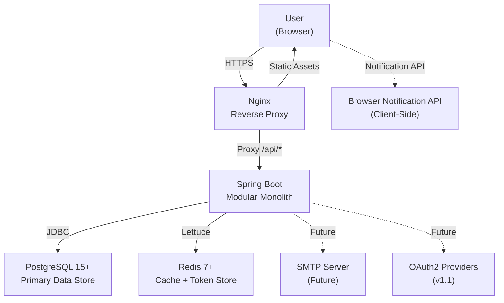

# Clarity (todo-app) -- High-Level Design

**Project:** todo-app
**Phase:** Design
**Created:** 2026-03-07
**Status:** Draft
**Based on:** docs/prd/prd.md, docs/ideation/product-vision.md, docs/prd/roadmap.md

---

## Table of Contents

1. [System Overview](#1-system-overview)
2. [Component Architecture](#2-component-architecture)
3. [Technology Stack](#3-technology-stack)
4. [Data Architecture](#4-data-architecture)
5. [Integration Architecture](#5-integration-architecture)
6. [Deployment Architecture](#6-deployment-architecture)
7. [Cross-Cutting Concerns](#7-cross-cutting-concerns)
8. [NFR Mapping](#8-nfr-mapping)

---

## 1. System Overview

### Architecture Style

Clarity adopts a **Modular Monolith** architecture. The entire backend is a single Spring Boot 3.x application with internal module boundaries enforced through Domain-Driven Design (DDD) package conventions. This is not a microservices deployment. All domain logic, API endpoints, and persistence reside in one JVM process.

**Rationale:** The MVP targets fewer than 1,000 users. A modular monolith eliminates the operational overhead of distributed systems (service discovery, inter-service networking, distributed tracing) while maintaining clean bounded context separation that allows future extraction into services if the product scales beyond its initial scope.

### System Context Diagram (ASCII)

```
                                  ┌─────────────────────────┐
                                  │     Browser Client      │
                                  │   (Chrome, Firefox,     │
                                  │    Safari, Edge)        │
                                  └───────────┬─────────────┘
                                              │
                                              │ HTTPS (REST API + Static Assets)
                                              │
                                  ┌───────────▼─────────────┐
                                  │    Nginx Reverse Proxy  │
                                  │   (serves Angular SPA   │
                                  │    + proxies /api/*)    │
                                  └───────────┬─────────────┘
                                              │
                                ┌─────────────▼──────────────┐
                                │                            │
                                │   Spring Boot Application  │
                                │   (Modular Monolith)       │
                                │                            │
                                │  ┌──────────────────────┐  │
                                │  │  Task Management     │  │
                                │  │  Bounded Context     │  │
                                │  │                      │  │
                                │  │  api/                │  │
                                │  │  application/        │  │
                                │  │  domain/             │  │
                                │  │  infrastructure/     │  │
                                │  └──────────────────────┘  │
                                │                            │
                                └──────┬──────────┬──────────┘
                                       │          │
                              ┌────────▼──┐  ┌────▼───────┐
                              │PostgreSQL │  │   Redis    │
                              │  15+      │  │   7+       │
                              │           │  │            │
                              │ Primary   │  │ Cache +    │
                              │ Data Store│  │ Token Store│
                              └───────────┘  └────────────┘


  ┌──────────────────┐
  │  External:       │
  │  Browser         │
  │  Notification API│     (client-side only, no server push in MVP)
  └──────────────────┘

  ┌──────────────────┐
  │  Future:         │
  │  SMTP Server     │     (password reset emails -- console log in dev)
  │  OAuth2 Providers│     (Google, GitHub -- deferred to v1.1)
  │  Message Broker  │     (Kafka/RabbitMQ -- interfaces only in MVP)
  └──────────────────┘
```

### System Context Diagram (Mermaid)

See: `docs/architecture/hld/diagrams/system-context.mmd`



---

### Architecture Decision Records (ADRs)

#### ADR-001: Modular Monolith over Microservices

| Field | Detail |
|-------|--------|
| **Status** | Accepted |
| **Context** | The MVP targets fewer than 1,000 users and is maintained by a single developer augmented by AI agents. The application has one bounded context (Task Management). |
| **Decision** | Deploy as a single Spring Boot application with DDD package boundaries. No service decomposition. |
| **Consequences** | (+) Simplified deployment, debugging, and testing. (+) No distributed system overhead (no service mesh, no distributed tracing). (+) Faster development velocity. (-) Cannot scale individual contexts independently. (-) Single point of failure at the JVM level. |
| **Alternatives Rejected** | Microservices (excessive operational overhead for a single-context MVP), Serverless functions (cold start latency, vendor lock-in, poor fit for stateful task management). |

#### ADR-002: JWT-Based Stateless Authentication

| Field | Detail |
|-------|--------|
| **Status** | Accepted |
| **Context** | The application needs user authentication. Session-based auth requires server-side session storage and introduces session affinity concerns if scaling horizontally. |
| **Decision** | Use JWT access tokens (15-minute expiry) with refresh tokens (7-day expiry) stored in Redis. Stateless request authentication via the access token. Refresh tokens are rotated on use and blacklisted on logout. |
| **Consequences** | (+) Stateless backend enables horizontal scaling without session affinity. (+) Refresh token rotation limits exposure window. (-) JWT revocation requires a token blacklist in Redis (adds a dependency). (-) Token size is larger than session cookies. |
| **Alternatives Rejected** | Server-side sessions (requires sticky sessions or shared session store, complicates scaling), OAuth2-only (adds external dependency for basic email/password auth). |

#### ADR-003: Redis for Caching and Token Storage

| Field | Detail |
|-------|--------|
| **Status** | Accepted |
| **Context** | The application needs caching for frequently accessed data (task lists, today view) and a store for refresh token blacklisting. |
| **Decision** | Use Redis 7+ as a shared cache and token store. The application must degrade gracefully if Redis is unavailable (NFR-003.3). Cache-aside pattern: read from cache first, fall back to database, populate cache on miss. |
| **Consequences** | (+) Significant read performance improvement for task list queries. (+) Centralized token blacklist enables instant logout across all devices. (+) Redis TTL handles automatic cache and token expiry. (-) Additional infrastructure component to operate. (-) Cache invalidation complexity on task mutations. |
| **Alternatives Rejected** | In-memory caching only (Caffeine/Guava -- does not support multi-instance deployment, no shared token store), No caching (acceptable for MVP load but misses the learning objective). |

#### ADR-004: NgRx for Frontend State Management

| Field | Detail |
|-------|--------|
| **Status** | Accepted |
| **Context** | The Angular frontend needs to manage task lists, today view state, user session, and sidebar navigation state. Multiple components share the same task data. Optimistic UI updates are required for responsiveness. |
| **Decision** | Use NgRx (Redux pattern) for global application state. Use Angular Signals for component-local state. Optimistic updates dispatch actions immediately and reconcile on API response. |
| **Consequences** | (+) Predictable state management with time-travel debugging. (+) Clear separation of side effects via NgRx Effects. (+) Optimistic updates provide instant UI feedback. (-) Boilerplate overhead (actions, reducers, selectors, effects) for each feature. (-) Learning curve for developers unfamiliar with Redux. |
| **Alternatives Rejected** | Signals-only (insufficient for complex cross-component state like task list + today view synchronization), RxJS BehaviorSubjects (no DevTools, no action history, harder to debug), Akita/NGXS (smaller ecosystem than NgRx). |

#### ADR-005: PostgreSQL as the Primary Database

| Field | Detail |
|-------|--------|
| **Status** | Accepted |
| **Context** | The application stores structured relational data (users, tasks, task lists) with foreign key relationships and needs full-text search capabilities. |
| **Decision** | Use PostgreSQL 15+ as the sole relational database. Use JSONB columns for flexible metadata storage where schema evolution is expected. Use PostgreSQL's built-in full-text search for MVP search functionality (no Elasticsearch in MVP). UUIDs for all primary keys to support future distributed scaling. |
| **Consequences** | (+) Mature, well-supported RDBMS with excellent Spring Data JPA integration. (+) JSONB provides schema flexibility without a separate document store. (+) Built-in full-text search eliminates the need for Elasticsearch in MVP. (+) UUID primary keys are globally unique and merge-safe. (-) Slightly heavier than SQLite/H2 for a small-scale MVP. (-) Full-text search performance is adequate but not as feature-rich as Elasticsearch. |
| **Alternatives Rejected** | SQLite (no concurrent access, no network access), H2 (not production-grade), MongoDB (relational data fits better in RDBMS, foreign keys needed). |

#### ADR-006: Browser Notification API for Reminders

| Field | Detail |
|-------|--------|
| **Status** | Accepted |
| **Context** | Users need deadline reminders (FR-006.3). There is no mobile app and no server-side push infrastructure in the MVP. |
| **Decision** | Use the browser Notification API with client-side scheduling. The Angular frontend periodically checks upcoming due dates and fires local notifications. No Service Worker or Web Push in MVP. Fallback to in-app notification badge if browser permission is denied. |
| **Consequences** | (+) No server-side push infrastructure required. (+) Simple implementation with the Web Notification API. (-) Notifications only fire when the browser tab is open or in the background (not when browser is closed). (-) Safari has limited support. (-) User must grant notification permission. |
| **Alternatives Rejected** | Web Push via Service Worker (adds complexity, requires VAPID keys and a push service), Server-Sent Events (requires persistent connection, no notification when browser is closed), Email reminders (requires SMTP server, adds infrastructure). |

#### ADR-007: Flyway for Database Migrations

| Field | Detail |
|-------|--------|
| **Status** | Accepted |
| **Context** | Database schema changes must be versioned, reproducible, and auditable. Manual schema changes in production are prohibited (NFR-006.5). |
| **Decision** | Use Flyway for all schema migrations. Migration files follow the naming convention `V{version}__{description}.sql`. Migrations run automatically on application startup. No manual DDL in any environment. |
| **Consequences** | (+) Schema changes are version-controlled alongside application code. (+) Automatic migration on startup simplifies deployment. (+) Audit trail of all schema changes. (-) Rollback requires writing a separate undo migration. (-) Must be careful with data migrations on large tables. |
| **Alternatives Rejected** | Liquibase (more features than needed, XML-based format is verbose), JPA auto-DDL (not production-safe, no versioning, no reproducibility). |

---

## 2. Component Architecture

### Component Diagram (ASCII)

```
┌──────────────────────────────────────────────────────────────────────────┐
│                          BROWSER (Angular 17+ SPA)                       │
│                                                                          │
│  ┌────────────┐  ┌────────────┐  ┌────────────┐  ┌──────────────────┐   │
│  │ Auth       │  │ Task       │  │ Today View │  │ Task List       │   │
│  │ Feature    │  │ Feature    │  │ Feature    │  │ Feature          │   │
│  │ Module     │  │ Module     │  │ Module     │  │ Module           │   │
│  └─────┬──────┘  └─────┬──────┘  └─────┬──────┘  └───────┬──────────┘   │
│        │               │               │                  │              │
│  ┌─────▼───────────────▼───────────────▼──────────────────▼──────────┐   │
│  │                        NgRx Store                                 │   │
│  │  (Actions, Reducers, Selectors, Effects)                          │   │
│  └─────────────────────────────┬─────────────────────────────────────┘   │
│                                │                                         │
│  ┌─────────────────────────────▼─────────────────────────────────────┐   │
│  │                     Core Services Layer                           │   │
│  │  AuthService  |  TaskService  |  ListService  |  NotificationSvc  │   │
│  │  HTTP Interceptor (JWT)  |  Auth Guard  |  Error Interceptor      │   │
│  └─────────────────────────────┬─────────────────────────────────────┘   │
│                                │                                         │
└────────────────────────────────┼─────────────────────────────────────────┘
                                 │  HTTPS (REST API calls)
                                 │
┌────────────────────────────────▼─────────────────────────────────────────┐
│                    SPRING BOOT APPLICATION (Modular Monolith)             │
│                                                                          │
│  ┌───────────────────────────────────────────────────────────────────┐   │
│  │                        API Layer                                  │   │
│  │  AuthController  |  TaskController  |  TaskListController         │   │
│  │  GlobalExceptionHandler (@ControllerAdvice)                       │   │
│  │  Request/Response DTOs  |  Bean Validation                        │   │
│  └──────────────────────────────┬────────────────────────────────────┘   │
│                                 │                                        │
│  ┌──────────────────────────────▼────────────────────────────────────┐   │
│  │                     Application Layer                             │   │
│  │  AuthApplicationService  |  TaskApplicationService                │   │
│  │  TaskListApplicationService                                       │   │
│  │  Command DTOs  |  Query DTOs  |  MapStruct Mappers                │   │
│  └──────────────────────────────┬────────────────────────────────────┘   │
│                                 │                                        │
│  ┌──────────────────────────────▼────────────────────────────────────┐   │
│  │                       Domain Layer                                │   │
│  │  Task (Aggregate Root)  |  TaskList (Aggregate Root)              │   │
│  │  User (Entity)                                                    │   │
│  │  Priority (VO)  |  DueDate (VO)  |  Email (VO)  |  ListColor(VO) │   │
│  │  TaskRepository (Port)  |  TaskListRepository (Port)              │   │
│  │  UserRepository (Port)                                            │   │
│  │  TaskCompletedEvent  |  TaskCreatedEvent  |  UserRegisteredEvent  │   │
│  │  Domain Exceptions                                                │   │
│  └──────────────────────────────┬────────────────────────────────────┘   │
│                                 │                                        │
│  ┌──────────────────────────────▼────────────────────────────────────┐   │
│  │                    Infrastructure Layer                           │   │
│  │  JpaTaskRepository  |  JpaTaskListRepository  |  JpaUserRepo      │   │
│  │  JPA Entities (@Entity)  |  Spring Data JPA                       │   │
│  │  RedisTokenStore  |  RedisCacheManager                            │   │
│  │  JwtTokenProvider  |  BCryptPasswordEncoder                       │   │
│  │  Spring Security Config  |  Flyway Migrations                     │   │
│  └──────────────┬───────────────────────────────┬────────────────────┘   │
│                 │                               │                        │
└─────────────────┼───────────────────────────────┼────────────────────────┘
                  │                               │
         ┌────────▼──────────┐           ┌────────▼──────────┐
         │   PostgreSQL 15+  │           │    Redis 7+       │
         │                   │           │                   │
         │ Tables:           │           │ Keys:             │
         │  - users          │           │  - token:blacklist│
         │  - tasks          │           │  - cache:tasks:*  │
         │  - task_lists     │           │  - cache:lists:*  │
         │  - refresh_tokens │           │  - cache:today:*  │
         └───────────────────┘           └───────────────────┘
```

### Component Diagram (Mermaid)

See: `docs/architecture/hld/diagrams/component-diagram.mmd`

### Component Responsibilities

| Component | Layer | Responsibility |
|-----------|-------|----------------|
| **AuthController** | API | Handles `/api/auth/**` endpoints: register, login, logout, refresh, forgot-password, reset-password |
| **TaskController** | API | Handles `/api/tasks/**` endpoints: CRUD, complete/uncomplete, today toggle, sort, filter |
| **TaskListController** | API | Handles `/api/lists/**` endpoints: CRUD, task counts |
| **GlobalExceptionHandler** | API | Catches domain/validation exceptions and maps to structured HTTP error responses |
| **AuthApplicationService** | Application | Orchestrates registration, login, token refresh, password reset workflows |
| **TaskApplicationService** | Application | Orchestrates task creation, update, completion, deletion, today assignment |
| **TaskListApplicationService** | Application | Orchestrates list creation, update, deletion (with task migration to Inbox) |
| **Task** | Domain | Aggregate root. Enforces invariants: title required, valid priority, soft delete. Emits domain events. |
| **TaskList** | Domain | Aggregate root. Enforces invariants: name required, unique per user, Inbox undeletable. |
| **User** | Domain | Entity. Enforces invariants: valid email, hashed password, lockout after 5 failures. |
| **Priority** | Domain | Value object. Enum: P1 (Urgent), P2 (High), P3 (Medium), P4 (Low). |
| **DueDate** | Domain | Value object. Wraps LocalDate/LocalDateTime. Provides overdue checking logic. |
| **JpaTaskRepository** | Infrastructure | Implements TaskRepository port using Spring Data JPA. |
| **RedisTokenStore** | Infrastructure | Stores refresh token blacklist with TTL-based expiry. |
| **RedisCacheManager** | Infrastructure | Cache-aside pattern for task lists and today view queries. |
| **JwtTokenProvider** | Infrastructure | Generates and validates JWT access/refresh tokens. |
| **Spring Security Config** | Infrastructure | Configures authentication filter chain, endpoint authorization, CORS, security headers. |
| **Auth Feature Module** | Frontend | Login, registration, forgot-password, reset-password pages. |
| **Task Feature Module** | Frontend | Task list view, task detail panel, inline creation, completion animation. |
| **Today View Feature Module** | Frontend | Today view page, overdue section, done-today section, progress counter. |
| **Task List Feature Module** | Frontend | Sidebar navigation, list management (create, rename, delete, color picker). |
| **NgRx Store** | Frontend | Centralized state: tasks, lists, auth, UI state. Actions, reducers, selectors, effects. |
| **AuthService** | Frontend | HTTP calls to `/api/auth/**`. Manages JWT storage and refresh flow. |
| **TaskService** | Frontend | HTTP calls to `/api/tasks/**`. |
| **ListService** | Frontend | HTTP calls to `/api/lists/**`. |
| **HTTP Interceptor** | Frontend | Attaches JWT to all API requests. Handles 401 by triggering token refresh. |
| **Auth Guard** | Frontend | Protects routes. Redirects unauthenticated users to login. |

### Layer Diagram

```
┌──────────────────────────────────────────────────────┐
│                     API Layer                        │
│  Controllers, DTOs, Validation, Exception Handling   │
│  Depends on: Application Layer                       │
│  Does NOT depend on: Domain, Infrastructure          │
├──────────────────────────────────────────────────────┤
│                  Application Layer                   │
│  Application Services, Commands, Queries, Mappers    │
│  Depends on: Domain Layer                            │
│  Does NOT depend on: API, Infrastructure             │
├──────────────────────────────────────────────────────┤
│                    Domain Layer                      │
│  Entities, Value Objects, Aggregates, Events,        │
│  Repository Interfaces (Ports), Domain Services      │
│  Depends on: NOTHING (zero external imports)         │
├──────────────────────────────────────────────────────┤
│                Infrastructure Layer                  │
│  JPA Repositories (Adapters), JPA Entities,          │
│  Redis, Security Config, External Integrations       │
│  Depends on: Domain Layer (implements ports)         │
└──────────────────────────────────────────────────────┘

  Dependency Rule: Dependencies point INWARD only.
  Domain has ZERO infrastructure imports (NFR-006.3).
```

---

## 3. Technology Stack

### Core Stack

| Layer | Technology | Version | Purpose | Justification |
|-------|-----------|---------|---------|---------------|
| **Backend Runtime** | Java | 17+ (LTS) | Application runtime | Long-term support, modern language features (records, sealed classes, pattern matching) |
| **Backend Framework** | Spring Boot | 3.x | Web framework, DI, auto-configuration | Industry standard for Java enterprise applications, excellent DDD ecosystem |
| **Frontend Framework** | Angular | 17+ | Single Page Application | TypeScript-first, standalone components, Signals API, built-in forms/routing/HTTP |
| **Primary Database** | PostgreSQL | 15+ | Relational data storage | ACID compliance, JSONB, full-text search, UUID support, excellent Spring Data JPA integration |
| **Cache** | Redis | 7+ | Caching and token storage | Sub-millisecond reads, TTL-based expiry, cache-aside pattern |
| **Reverse Proxy** | Nginx | Latest stable | Serve SPA, proxy API, TLS termination | Lightweight, high performance, standard for SPA deployments |

### Backend Libraries

| Library | Version | Purpose | Alternative Considered |
|---------|---------|---------|----------------------|
| **Spring Web** | (Boot managed) | REST API controllers | -- |
| **Spring Data JPA** | (Boot managed) | Repository abstraction over Hibernate | Raw JDBC (too verbose) |
| **Spring Security** | (Boot managed) | Authentication, authorization, CORS, CSRF, security headers | Apache Shiro (smaller ecosystem) |
| **Spring Validation** | (Boot managed) | Bean Validation (JSR 380) on DTOs | Manual validation (error-prone) |
| **Spring Actuator** | (Boot managed) | Health checks, metrics endpoints | Custom health endpoint (reinventing the wheel) |
| **Hibernate** | (Boot managed) | JPA implementation / ORM | EclipseLink (less community support) |
| **HikariCP** | (Boot managed) | JDBC connection pool | Tomcat pool (HikariCP is faster and default in Spring Boot) |
| **Flyway** | 9.x+ | Database migration versioning | Liquibase (more complex than needed) |
| **MapStruct** | 1.5+ | Compile-time DTO mapping | ModelMapper (runtime reflection, slower) |
| **Lombok** | Latest | Boilerplate reduction (builders, getters) | Java records for DTOs (used alongside Lombok for entities) |
| **jjwt (io.jsonwebtoken)** | 0.12+ | JWT token creation and validation | Spring Security OAuth2 Resource Server (heavier for simple JWT) |
| **Lettuce** | (Boot managed) | Redis client (non-blocking) | Jedis (blocking I/O) |
| **Jackson** | (Boot managed) | JSON serialization/deserialization | Gson (less Spring integration) |
| **SLF4J + Logback** | (Boot managed) | Structured logging | Log4j2 (acceptable but Logback is Spring Boot default) |
| **JUnit 5** | (Boot managed) | Unit and integration testing | TestNG (smaller community) |
| **Mockito** | (Boot managed) | Test mocking | EasyMock (less fluent API) |
| **Testcontainers** | 1.19+ | Integration tests with real PostgreSQL/Redis | H2 in-memory (behavior differences from PostgreSQL) |

### Frontend Libraries

| Library | Version | Purpose | Alternative Considered |
|---------|---------|---------|----------------------|
| **Angular CLI** | 17+ | Build tooling, scaffolding | -- |
| **NgRx** | 17+ | Redux-based state management | NGXS (smaller ecosystem), Akita (less active) |
| **RxJS** | 7+ | Reactive programming (Effects, HTTP) | Promises (insufficient for complex async) |
| **Angular Material** | 17+ | UI component library (datepicker, dialogs, forms) | PrimeNG, Tailwind + headless (Material integrates best with Angular) |
| **Tailwind CSS** | 3.x | Utility-first CSS for custom styling | Bootstrap (opinionated, harder to customize for minimalist design) |
| **date-fns** | 3+ | Date formatting, relative time | Moment.js (deprecated, large bundle), Day.js (acceptable alternative) |
| **Jest** | 29+ | Unit testing | Karma/Jasmine (Jest is faster, better DX) |
| **Angular Testing Library** | Latest | Component testing | TestBed-only (Testing Library encourages user-centric tests) |

### Build and DevOps

| Tool | Purpose |
|------|---------|
| **Maven** | Backend build, dependency management, test execution |
| **Angular CLI (ng)** | Frontend build, dev server, test execution |
| **Docker** | Containerization for backend (multi-stage) and frontend (nginx) |
| **Docker Compose** | Multi-container orchestration (dev and prod) |
| **GitHub Actions** | CI/CD pipeline (build, test, security scan) |
| **JaCoCo** | Backend code coverage reporting |
| **Istanbul/Jest** | Frontend code coverage reporting |

---

## 4. Data Architecture

### Data Flow Diagram (ASCII)

```
  ┌──────────┐         ┌──────────────┐         ┌──────────────────┐
  │  User    │  (1)    │  Angular SPA │  (2)    │  Spring Boot     │
  │  Action  │────────▶│  Component   │────────▶│  Controller      │
  │          │         │              │  HTTP   │  (Validation)    │
  └──────────┘         └──────┬───────┘  POST   └────────┬─────────┘
                              │                          │
                              │                    (3)   │
                              │                          ▼
                              │                 ┌──────────────────┐
                              │                 │  Application     │
                              │                 │  Service         │
                              │                 │  (Orchestration) │
                              │                 └────────┬─────────┘
                              │                          │
                              │                    (4)   │
                              │                          ▼
                              │                 ┌──────────────────┐
                              │                 │  Domain Layer    │
                              │                 │  (Business Logic │
                              │                 │   + Invariants)  │
                              │                 └────────┬─────────┘
                              │                          │
                              │                    (5)   │
                              │                          ▼
                              │                 ┌──────────────────┐
                              │           ┌─────│  Infrastructure  │─────┐
                              │           │     │  (Repository)    │     │
                              │           │     └──────────────────┘     │
                              │           │                              │
                              │     (6)   ▼                        (6)  ▼
                              │  ┌──────────────┐              ┌──────────┐
                              │  │ PostgreSQL   │              │  Redis   │
                              │  │ (Write/Read) │              │  (Cache) │
                              │  └──────────────┘              └──────────┘
                              │
                       (7)    │  API Response (JSON)
                              │
                              ▼
                     ┌──────────────────┐
                     │  NgRx Store      │
                     │  (State Update)  │
                     │  → UI Re-render  │
                     └──────────────────┘

  Flow:
  (1) User interacts (click, type, submit)
  (2) Component dispatches NgRx Action → Effect calls HTTP service
  (3) Controller validates DTO, delegates to application service
  (4) Application service calls domain methods, enforces business rules
  (5) Domain layer enforces invariants, produces domain events
  (6) Infrastructure persists to PostgreSQL, invalidates/updates Redis cache
  (7) HTTP response flows back through layers → NgRx reducer updates state → UI re-renders
```

### Data Flow Diagram (Mermaid)

See: `docs/architecture/hld/diagrams/data-flow.mmd`

### Data Storage Strategy

| Data Type | Storage | Rationale |
|-----------|---------|-----------|
| **User accounts** | PostgreSQL `users` table | Relational, requires referential integrity with tasks and lists |
| **Tasks** | PostgreSQL `tasks` table | Core domain data, relational (belongs to user and list), needs ACID transactions |
| **Task Lists** | PostgreSQL `task_lists` table | Relational (one-to-many with tasks), needs foreign key enforcement |
| **Refresh Tokens** | PostgreSQL `refresh_tokens` table | Must survive Redis restarts, needs audit trail |
| **Password Reset Tokens** | PostgreSQL (column on users or separate table) | Time-bounded, needs persistence |
| **Active Task Lists (cached)** | Redis (key: `cache:tasks:user:{userId}:list:{listId}`) | Read-heavy, benefits from sub-millisecond cache reads |
| **Today View (cached)** | Redis (key: `cache:today:user:{userId}`) | Queried on every login and page load |
| **List Counts (cached)** | Redis (key: `cache:counts:user:{userId}`) | Queried by sidebar on every navigation |
| **Token Blacklist** | Redis (key: `token:blacklist:{jti}`, TTL = remaining token expiry) | Fast lookup needed on every authenticated request; TTL auto-cleans expired entries |
| **User Preferences** | Browser localStorage | Theme preference, sort preference. Not sensitive. Client-only. |

### Caching Strategy

**Pattern:** Cache-Aside (Lazy Loading)

```
READ PATH:
  1. Check Redis for cached data
  2. If HIT → return cached data
  3. If MISS → query PostgreSQL → store result in Redis with TTL → return data

WRITE PATH:
  1. Write to PostgreSQL (source of truth)
  2. Invalidate related Redis keys (do NOT update cache -- invalidate and let next read repopulate)
  3. Return success to caller
```

**Cache TTL Values:**

| Cache Key Pattern | TTL | Invalidated By |
|-------------------|-----|----------------|
| `cache:tasks:user:{userId}:list:{listId}` | 5 minutes | Task create, update, delete, complete, move |
| `cache:today:user:{userId}` | 2 minutes | Task create, complete, delete, today toggle, due date change |
| `cache:counts:user:{userId}` | 5 minutes | Task create, delete, complete, move between lists |
| `token:blacklist:{jti}` | Equal to remaining access token lifetime | Logout (set), never manually cleared (TTL handles it) |

**Graceful Degradation (NFR-003.3):**
If Redis is unavailable, the application falls back to direct PostgreSQL queries for all reads. Token blacklist checks are skipped (accepting a brief window where a logged-out token may still be valid until its 15-minute expiry). A health check indicator reports Redis status.

---

## 5. Integration Architecture

### Primary Integration: REST API

All client-server communication uses RESTful HTTP over HTTPS. The Angular SPA communicates exclusively with the Spring Boot backend via JSON REST APIs.

**API Base URL:** `/api/v1`

**Endpoint Groups:**

| Resource | Endpoints | Auth Required | Rate Limited |
|----------|-----------|---------------|--------------|
| **Auth** | `POST /api/v1/auth/register` | No | Yes (10/min/IP) |
| | `POST /api/v1/auth/login` | No | Yes (10/min/IP) |
| | `POST /api/v1/auth/refresh` | No (uses refresh token) | Yes (10/min/IP) |
| | `POST /api/v1/auth/logout` | Yes | No |
| | `POST /api/v1/auth/forgot-password` | No | Yes (5/min/IP) |
| | `POST /api/v1/auth/reset-password` | No (uses reset token) | Yes (5/min/IP) |
| **Tasks** | `GET /api/v1/tasks` | Yes | No |
| | `POST /api/v1/tasks` | Yes | No |
| | `GET /api/v1/tasks/{id}` | Yes | No |
| | `PUT /api/v1/tasks/{id}` | Yes | No |
| | `DELETE /api/v1/tasks/{id}` | Yes | No |
| | `PATCH /api/v1/tasks/{id}/complete` | Yes | No |
| | `PATCH /api/v1/tasks/{id}/uncomplete` | Yes | No |
| | `PATCH /api/v1/tasks/{id}/today` | Yes | No |
| | `GET /api/v1/tasks/today` | Yes | No |
| **Lists** | `GET /api/v1/lists` | Yes | No |
| | `POST /api/v1/lists` | Yes | No |
| | `PUT /api/v1/lists/{id}` | Yes | No |
| | `DELETE /api/v1/lists/{id}` | Yes | No |
| | `GET /api/v1/lists/counts` | Yes | No |
| **Health** | `GET /actuator/health` | No | No |

### Browser Notification API

Reminders are handled entirely on the client side in the MVP. The Angular `NotificationService` performs the following:

1. On login, requests browser notification permission if not already granted.
2. Fetches tasks with upcoming due dates from the NgRx store.
3. Sets JavaScript timers (`setTimeout`) for each reminder based on the configured interval (at due time, 15min before, 30min before, 1hr before, 1 day before).
4. When a timer fires, dispatches a browser `Notification` if permission was granted, or shows an in-app badge if permission was denied.
5. Timers are recalculated when tasks are created, updated, or deleted.

**Limitation:** Notifications only fire while the Angular application is loaded in a browser tab. If the user closes the browser, no notification is delivered. This is acceptable for the MVP scope.

### Messaging Interfaces (MVP -- Not Implemented)

The following interfaces are defined in the codebase but have no runtime implementation in the MVP. They serve as extension points for post-MVP features.

```java
// domain/event/DomainEventPublisher.java (interface)
public interface DomainEventPublisher {
    void publish(DomainEvent event);
}

// infrastructure/messaging/InMemoryEventPublisher.java (MVP implementation)
// Logs the event and dispatches to in-process listeners via Spring ApplicationEventPublisher.
// Post-MVP: replace with KafkaEventPublisher or RabbitMqEventPublisher.
```

**Defined Domain Events (in-process only in MVP):**

| Event | Trigger | MVP Handler | Future Handler |
|-------|---------|-------------|----------------|
| `UserRegisteredEvent` | User registration | Create default "Inbox" list | Send welcome email |
| `TaskCreatedEvent` | Task creation | Invalidate cache | Publish to activity feed |
| `TaskCompletedEvent` | Task marked complete | Invalidate cache, update counts | Update analytics, streak tracking |
| `TaskDeletedEvent` | Task soft-deleted | Invalidate cache | Archive to cold storage |
| `TaskListDeletedEvent` | List deleted | Migrate tasks to Inbox, invalidate cache | -- |

### CORS Configuration

```
Allowed Origins:  http://localhost:4200 (dev), https://clarity.example.com (prod)
Allowed Methods:  GET, POST, PUT, PATCH, DELETE, OPTIONS
Allowed Headers:  Authorization, Content-Type, X-Requested-With
Exposed Headers:  X-Total-Count (for paginated responses)
Max Age:          3600 seconds (1 hour preflight cache)
Credentials:      true (for refresh token cookies if used)
```

---

## 6. Deployment Architecture

### Development Environment (Docker Compose)

```
  ┌──────────────────────────────────────────────────────────────┐
  │                   Developer Machine                          │
  │                                                              │
  │  ┌──────────────────────┐  ┌──────────────────────────────┐  │
  │  │  Angular Dev Server  │  │  Spring Boot (IDE/Maven)     │  │
  │  │  ng serve            │  │  mvn spring-boot:run          │  │
  │  │  localhost:4200      │  │  localhost:8080                │  │
  │  │  (hot reload)        │  │  (profile: dev)               │  │
  │  └──────────┬───────────┘  └──────────┬───────────────────┘  │
  │             │ proxy /api/*             │                      │
  │             └──────────────────────────┘                      │
  │                                    │                          │
  │  ┌─────────────────────────────────┼────────────────────┐    │
  │  │           Docker Compose        │                    │    │
  │  │                                 │                    │    │
  │  │  ┌──────────────┐     ┌─────────▼──────┐            │    │
  │  │  │ PostgreSQL   │     │    Redis       │            │    │
  │  │  │ Port: 5432   │     │    Port: 6379  │            │    │
  │  │  │ DB: clarity  │     │                │            │    │
  │  │  │ User: dev    │     │                │            │    │
  │  │  └──────────────┘     └────────────────┘            │    │
  │  │                                                      │    │
  │  │  Volume: ./data/postgres → /var/lib/postgresql/data  │    │
  │  └──────────────────────────────────────────────────────┘    │
  │                                                              │
  └──────────────────────────────────────────────────────────────┘
```

**docker-compose.yml (dev):**

| Service | Image | Port | Purpose |
|---------|-------|------|---------|
| `postgres` | `postgres:15-alpine` | 5432 | Primary data store |
| `redis` | `redis:7-alpine` | 6379 | Cache and token store |

The Angular dev server and Spring Boot application run natively on the developer machine (not in Docker) for fast iteration and hot reloading. The Angular proxy configuration (`proxy.conf.json`) forwards `/api/*` requests to `localhost:8080`.

### Production Environment (Docker Compose)

```
  ┌──────────────────────────────────────────────────────────────────┐
  │                     Production Server (Single VM)                │
  │                                                                  │
  │  ┌────────────────────────────────────────────────────────────┐  │
  │  │                  Docker Compose                            │  │
  │  │                                                            │  │
  │  │  ┌──────────────────┐                                      │  │
  │  │  │   Nginx          │  Port 80/443 (host)                  │  │
  │  │  │                  │                                      │  │
  │  │  │  - TLS termination                                      │  │
  │  │  │  - Serves Angular │                                      │  │
  │  │  │    static files   │                                      │  │
  │  │  │  - Proxies /api/* │                                      │  │
  │  │  │    to backend     │                                      │  │
  │  │  └───────┬──────────┘                                      │  │
  │  │          │                                                  │  │
  │  │          │ proxy_pass http://backend:8080                   │  │
  │  │          │                                                  │  │
  │  │  ┌───────▼──────────┐                                      │  │
  │  │  │  Spring Boot     │  Port 8080 (internal)                │  │
  │  │  │  (backend)       │                                      │  │
  │  │  │  profile: prod   │                                      │  │
  │  │  └──────┬───────┬───┘                                      │  │
  │  │         │       │                                           │  │
  │  │  ┌──────▼───┐ ┌─▼────────┐                                │  │
  │  │  │PostgreSQL│ │  Redis   │                                │  │
  │  │  │Port:5432 │ │Port:6379 │                                │  │
  │  │  │(internal)│ │(internal)│                                │  │
  │  │  └──────────┘ └──────────┘                                │  │
  │  │                                                            │  │
  │  │  Volumes:                                                  │  │
  │  │    postgres_data → /var/lib/postgresql/data                │  │
  │  │    redis_data    → /data                                   │  │
  │  │    nginx_certs   → /etc/nginx/certs                       │  │
  │  └────────────────────────────────────────────────────────────┘  │
  │                                                                  │
  └──────────────────────────────────────────────────────────────────┘
```

### Deployment Diagram (Mermaid)

See: `docs/architecture/hld/diagrams/deployment.mmd`

### Container Specifications

| Container | Base Image | Build Strategy | Exposed Port |
|-----------|-----------|----------------|--------------|
| **nginx** | `nginx:alpine` | Copy Angular production build + nginx.conf | 80, 443 |
| **backend** | `eclipse-temurin:17-jre-alpine` | Multi-stage Maven build (build stage + runtime stage) | 8080 |
| **postgres** | `postgres:15-alpine` | Official image with init scripts | 5432 (internal only) |
| **redis** | `redis:7-alpine` | Official image | 6379 (internal only) |

### Environment Strategy

| Environment | Database | Redis | Auth | Logging | Config Source |
|-------------|----------|-------|------|---------|---------------|
| **dev** | PostgreSQL (Docker) | Redis (Docker) | JWT, no lockout enforcement | DEBUG level, console output | `application-dev.yml` |
| **prod** | PostgreSQL (Docker, persistent volume) | Redis (Docker, persistent volume) | JWT, full lockout, rate limiting | INFO level, structured JSON | `application-prod.yml` + environment variables |

**Configuration Externalization (prod):**
All secrets are injected via environment variables, never committed to version control.

| Variable | Purpose |
|----------|---------|
| `SPRING_DATASOURCE_URL` | PostgreSQL JDBC URL |
| `SPRING_DATASOURCE_USERNAME` | Database username |
| `SPRING_DATASOURCE_PASSWORD` | Database password |
| `SPRING_DATA_REDIS_HOST` | Redis hostname |
| `JWT_SECRET` | JWT signing key (HS256) or path to RSA key (RS256) |
| `CORS_ALLOWED_ORIGINS` | Allowed frontend origins |

---

## 7. Cross-Cutting Concerns

### 7.1 Security

#### Authentication Flow

```
  ┌───────┐          ┌────────┐          ┌───────────┐       ┌──────┐     ┌───────┐
  │Browser│          │Angular │          │Spring Boot│       │Redis │     │  DB   │
  └───┬───┘          └───┬────┘          └─────┬─────┘       └──┬───┘     └───┬───┘
      │  Login form      │                     │                │             │
      │─────────────────▶│                     │                │             │
      │                  │ POST /api/v1/auth/  │                │             │
      │                  │      login          │                │             │
      │                  │────────────────────▶│                │             │
      │                  │                     │ Verify password│             │
      │                  │                     │────────────────┼────────────▶│
      │                  │                     │◀───────────────┼─────────────│
      │                  │                     │                │             │
      │                  │                     │ Generate JWT   │             │
      │                  │                     │ (access 15m    │             │
      │                  │                     │  + refresh 7d) │             │
      │                  │                     │                │             │
      │                  │  { accessToken,     │                │             │
      │                  │    refreshToken }   │                │             │
      │                  │◀────────────────────│                │             │
      │                  │                     │                │             │
      │                  │ Store tokens        │                │             │
      │                  │ (memory/httpOnly    │                │             │
      │                  │  cookie)            │                │             │
      │                  │                     │                │             │
      │  Redirect to     │                     │                │             │
      │  Today View      │                     │                │             │
      │◀─────────────────│                     │                │             │
      │                  │                     │                │             │
      │  API Request     │                     │                │             │
      │─────────────────▶│                     │                │             │
      │                  │ GET /api/v1/tasks/  │                │             │
      │                  │ today               │                │             │
      │                  │ Authorization:      │                │             │
      │                  │ Bearer <JWT>        │                │             │
      │                  │────────────────────▶│                │             │
      │                  │                     │ Validate JWT   │             │
      │                  │                     │ Check blacklist│             │
      │                  │                     │───────────────▶│             │
      │                  │                     │◀───────────────│             │
      │                  │                     │ Query tasks    │             │
      │                  │                     │────────────────┼────────────▶│
      │                  │                     │◀───────────────┼─────────────│
      │                  │ 200 OK { tasks }    │                │             │
      │                  │◀────────────────────│                │             │
      │  Render tasks    │                     │                │             │
      │◀─────────────────│                     │                │             │
```

#### Security Measures Summary

| Concern | Implementation |
|---------|---------------|
| **Password storage** | BCrypt with cost factor 12. Never stored in plaintext. |
| **JWT signing** | HS256 with a 256-bit secret (dev) or RS256 with RSA key pair (prod recommended). |
| **Access token** | 15-minute expiry. Stateless validation. Contains user ID, email, roles. |
| **Refresh token** | 7-day expiry. Stored in DB. Rotated on use (old token invalidated). |
| **Token blacklist** | On logout, the access token's JTI is added to Redis with TTL = remaining expiry. Every API request checks this blacklist. |
| **Account lockout** | 5 consecutive failed login attempts lock the account for 15 minutes. Counter resets on successful login. |
| **Rate limiting** | Auth endpoints: 10 requests/minute per IP. Password reset: 5/minute per IP. Implemented via a Spring filter or Bucket4j. |
| **CORS** | Whitelist-only origin configuration. No wildcard `*` in production. |
| **CSRF** | Disabled for stateless JWT API (no cookies for auth in MVP). If cookies are used for refresh tokens, CSRF protection must be re-enabled. |
| **Security headers** | CSP, HSTS (max-age=31536000, includeSubDomains), X-Frame-Options: DENY, X-Content-Type-Options: nosniff, Referrer-Policy: strict-origin-when-cross-origin. |
| **Input validation** | Bean Validation annotations on all request DTOs. XSS prevention via Angular's built-in template sanitization and output encoding. SQL injection prevention via JPA parameterized queries. |
| **Sensitive data in logs** | Passwords, tokens, and PII are never logged. SLF4J MDC used for correlation IDs without exposing sensitive context. |

### 7.2 Observability

| Aspect | Tool | Configuration |
|--------|------|---------------|
| **Logging** | SLF4J + Logback | Structured JSON logs in production. Console logs in dev. MDC with `correlationId`, `userId`, `requestPath`. |
| **Health checks** | Spring Actuator | `GET /actuator/health` exposes: application status, PostgreSQL connectivity, Redis connectivity, disk space. |
| **Metrics** | Spring Actuator + Micrometer | JVM metrics, HTTP request metrics (count, latency, status codes), HikariCP pool stats, cache hit/miss ratios. Exposed at `/actuator/prometheus` (optional). |
| **Error tracking** | Structured error responses | All exceptions mapped to `{ "status": 400, "error": "Bad Request", "message": "...", "timestamp": "...", "path": "..." }`. Stack traces never exposed to clients. |

**Log Levels by Environment:**

| Environment | Root | Application | Hibernate SQL | Spring Security |
|-------------|------|-------------|---------------|-----------------|
| dev | INFO | DEBUG | DEBUG | DEBUG |
| prod | WARN | INFO | OFF | WARN |

### 7.3 Performance

| Area | Approach | Target |
|------|----------|--------|
| **Database queries** | JPA with fetch joins for N+1 prevention. Indexes on `tasks(user_id, list_id, is_deleted, is_completed)`, `tasks(user_id, due_date)`, `tasks(user_id, is_today)`. | < 50ms per query |
| **Connection pooling** | HikariCP with `maximumPoolSize=10` (dev), `maximumPoolSize=20` (prod), `connectionTimeout=30000`, `idleTimeout=600000`. | No connection exhaustion under 100 concurrent users |
| **Redis caching** | Cache-aside pattern on task list reads and today view. 2-5 minute TTL. | Cache hit ratio > 80% for repeat reads |
| **Frontend rendering** | Angular OnPush change detection on all components. Virtual scrolling for lists > 50 items. Lazy loading for feature modules. | Task list rendering < 100ms for 200 tasks |
| **Bundle size** | Angular production build with tree-shaking, AOT compilation, and code splitting via lazy routes. | Initial bundle < 200KB gzipped |
| **API response size** | Pagination for task lists (default page size: 50, max: 200). No entity exposure (DTOs only). | < 500ms p95 for task CRUD |

### 7.4 Error Handling

**Backend Error Response Structure:**

```json
{
  "status": 422,
  "error": "Unprocessable Entity",
  "code": "TASK_TITLE_REQUIRED",
  "message": "Task title is required and cannot be empty.",
  "timestamp": "2026-03-07T10:30:00Z",
  "path": "/api/v1/tasks"
}
```

**Validation Error Response Structure:**

```json
{
  "status": 400,
  "error": "Bad Request",
  "code": "VALIDATION_FAILED",
  "message": "Request validation failed.",
  "details": [
    { "field": "title", "message": "must not be blank" },
    { "field": "priority", "message": "must be one of: P1, P2, P3, P4" }
  ],
  "timestamp": "2026-03-07T10:30:00Z",
  "path": "/api/v1/tasks"
}
```

**Exception Hierarchy:**

| Exception | HTTP Status | When |
|-----------|-------------|------|
| `EntityNotFoundException` | 404 Not Found | Task/List/User not found by ID |
| `BusinessRuleException` | 422 Unprocessable Entity | Domain invariant violation (e.g., deleting Inbox list) |
| `ValidationException` | 400 Bad Request | Bean Validation failures on DTO |
| `AuthenticationException` | 401 Unauthorized | Invalid/expired JWT, missing token |
| `AccessDeniedException` | 403 Forbidden | User accessing another user's data |
| `AccountLockedException` | 423 Locked | Account locked after 5 failed attempts |
| `RateLimitExceededException` | 429 Too Many Requests | Rate limit exceeded on auth endpoints |

**Frontend Error Handling:**

| HTTP Status | Angular Behavior |
|-------------|-----------------|
| 401 | HTTP interceptor attempts token refresh. If refresh fails, redirect to login. |
| 403 | Show "Access Denied" message. |
| 404 | Show "Not Found" page or toast. |
| 422 | Display business error message from response body. |
| 429 | Show "Too many attempts. Please try again in X minutes." |
| 500 | Show generic "Something went wrong" toast. Log error to console. |

---

## 8. NFR Mapping

This section maps each non-functional requirement from the PRD to the specific architectural decisions and components that address it.

### NFR-001: Performance

| NFR | Target | Architectural Approach |
|-----|--------|----------------------|
| NFR-001.1 | API response < 500ms (p95) | HikariCP connection pooling (20 connections), Redis cache-aside for reads, JPA fetch joins to prevent N+1, database indexes on `user_id`, `list_id`, `due_date`, `is_completed`, `is_deleted` |
| NFR-001.2 | FCP < 2 seconds on 4G | Angular AOT compilation, tree-shaking, lazy loading of feature modules, gzip compression in Nginx, code splitting per route |
| NFR-001.3 | TTI < 3 seconds | Minimal initial bundle (auth + today view only), lazy load remaining features, preload strategy for likely-next routes |
| NFR-001.4 | 200 tasks rendered < 100ms | Angular OnPush change detection, virtual scrolling (`cdk-virtual-scroll-viewport`), trackBy function on `*ngFor` |
| NFR-001.5 | Search results < 300ms | PostgreSQL `tsvector`/`tsquery` full-text search with GIN index on `tasks(title, description)`. Client-side debounce (300ms) to reduce API calls. |
| NFR-001.6 | 100 concurrent users | Stateless JWT auth (no session storage), HikariCP pool size of 20, Redis caching absorbs read load, Nginx handles static assets directly |

### NFR-002: Security

| NFR | Target | Architectural Approach |
|-----|--------|----------------------|
| NFR-002.1 | JWT (15min access, 7d refresh) | `JwtTokenProvider` in infrastructure layer. Access token: HS256/RS256 signed, contains userId, email, roles, jti, exp. Refresh token: opaque UUID stored in DB. |
| NFR-002.2 | BCrypt cost 12+ | `BCryptPasswordEncoder(12)` configured in Spring Security. Verified in security tests. |
| NFR-002.3 | All endpoints authenticated | Spring Security `SecurityFilterChain` with `requestMatchers("/api/auth/**", "/actuator/health").permitAll()` and `.anyRequest().authenticated()` |
| NFR-002.4 | TLS 1.2+ | Nginx configured with `ssl_protocols TLSv1.2 TLSv1.3`. SSL certificate via Let's Encrypt or provided. |
| NFR-002.5 | OWASP Top 10 | Addressed per category in section 7.1 and the security rules (`05-security.md`) |
| NFR-002.6 | Rate limiting 10/min on auth | Bucket4j or custom filter on `/api/v1/auth/**` endpoints. Key: client IP. Response: 429 with Retry-After header. |
| NFR-002.7 | No wildcard CORS | `CorsConfigurationSource` bean with explicit `allowedOrigins` list from `CORS_ALLOWED_ORIGINS` env var |
| NFR-002.8 | Security headers | Custom `SecurityHeadersFilter` or Spring Security `.headers()` configuration: CSP, HSTS, X-Frame-Options, X-Content-Type-Options |
| NFR-002.9 | Bean Validation on all DTOs | `@Valid` on all `@RequestBody` parameters. Custom validators for business rules (password strength, email format). |
| NFR-002.10 | No PII in logs | Logback pattern excludes Authorization header. Custom `toString()` on User entity excludes password. MDC uses userId (UUID), not email. |

### NFR-003: Availability and Reliability

| NFR | Target | Architectural Approach |
|-----|--------|----------------------|
| NFR-003.1 | 99% uptime | Docker restart policies (`restart: unless-stopped`). Nginx health check proxying. No single-point-of-failure at application level (PostgreSQL and Redis have restart policies too). |
| NFR-003.2 | Zero data loss | PostgreSQL ACID transactions. `@Transactional` on application service methods. WAL (Write-Ahead Logging) enabled by default in PostgreSQL. Persistent Docker volumes. |
| NFR-003.3 | Graceful Redis degradation | `RedisCacheManager` wrapped in try-catch. On `RedisConnectionException`, log warning and fall back to direct DB query. Token blacklist check returns "not blacklisted" if Redis is down (accepts 15-min risk window). |
| NFR-003.4 | Health check < 1 second | Spring Actuator auto-configures DB and Redis health indicators. Custom health contributor if needed. Response cached for 10 seconds. |

### NFR-004: Scalability

| NFR | Target | Architectural Approach |
|-----|--------|----------------------|
| NFR-004.1 | Stateless backend | JWT-based auth with no server-side HTTP sessions. `SessionCreationPolicy.STATELESS` in Spring Security config. |
| NFR-004.2 | Connection pooling | HikariCP (Spring Boot default). Configurable via `spring.datasource.hikari.*` properties. Dev: 10, Prod: 20. |
| NFR-004.3 | Horizontal scaling ready | Stateless JWT + externalized Redis = any number of backend instances behind a load balancer. Not deployed in MVP, but architecture supports it. |

### NFR-005: Usability and Accessibility

| NFR | Target | Architectural Approach |
|-----|--------|----------------------|
| NFR-005.1 | Keyboard navigation | Angular `tabindex` management, keyboard event handlers on all interactive elements, `Enter` to confirm, `Escape` to cancel, `Ctrl/Cmd+K` for quick add. |
| NFR-005.2 | WCAG 2.1 AA | Angular Material components provide baseline accessibility. Custom components require `aria-label`, `role`, color contrast (4.5:1 minimum). |
| NFR-005.3 | Responsive 320px-2560px | Tailwind CSS responsive utilities (`sm:`, `md:`, `lg:`, `xl:`). Mobile-first CSS. Sidebar collapses to hamburger menu on mobile. |
| NFR-005.4 | Onboarding < 30 seconds | Minimal registration form (email + password). Auto-redirect to Today View on first login. Default "Inbox" list pre-created. No wizard or tutorial. |

### NFR-006: Maintainability

| NFR | Target | Architectural Approach |
|-----|--------|----------------------|
| NFR-006.1 | Backend coverage >= 80% | JUnit 5 + Mockito for unit tests. Testcontainers for integration tests. JaCoCo configured in Maven with `<minimum>0.80</minimum>` rule. CI fails if coverage drops below threshold. |
| NFR-006.2 | Frontend coverage >= 70% | Jest + Angular Testing Library. Istanbul coverage reporter. CI fails if coverage drops below threshold. |
| NFR-006.3 | Domain layer isolation | ArchUnit test to verify `domain` package has zero imports from `infrastructure`, `api`, or `org.springframework`. Enforced in CI. |
| NFR-006.4 | Conventional commits + PRs | GitHub branch protection on `main` and `develop`. Commit message format enforced by commit-lint. PR template with checklist. |
| NFR-006.5 | Flyway migrations | All schema changes via `V{N}__{description}.sql` files. No `spring.jpa.hibernate.ddl-auto=update` in any profile. Flyway validates on startup. |

---

## Appendix A: Package Structure

### Backend (Spring Boot)

```
backend/
├── src/main/java/com/clarity/
│   ├── ClarityApplication.java
│   │
│   ├── task/                              # Task Management Bounded Context
│   │   ├── api/
│   │   │   ├── controller/
│   │   │   │   ├── TaskController.java
│   │   │   │   └── TaskListController.java
│   │   │   ├── dto/
│   │   │   │   ├── CreateTaskRequest.java
│   │   │   │   ├── UpdateTaskRequest.java
│   │   │   │   ├── TaskResponse.java
│   │   │   │   ├── CreateListRequest.java
│   │   │   │   ├── UpdateListRequest.java
│   │   │   │   └── TaskListResponse.java
│   │   │   └── advice/
│   │   │       └── TaskExceptionHandler.java
│   │   │
│   │   ├── application/
│   │   │   ├── service/
│   │   │   │   ├── TaskApplicationService.java
│   │   │   │   └── TaskListApplicationService.java
│   │   │   ├── command/
│   │   │   │   ├── CreateTaskCommand.java
│   │   │   │   ├── UpdateTaskCommand.java
│   │   │   │   └── CreateListCommand.java
│   │   │   ├── query/
│   │   │   │   ├── TaskQuery.java
│   │   │   │   └── TaskListQuery.java
│   │   │   └── mapper/
│   │   │       ├── TaskMapper.java
│   │   │       └── TaskListMapper.java
│   │   │
│   │   ├── domain/
│   │   │   ├── model/
│   │   │   │   ├── Task.java                # Aggregate Root
│   │   │   │   ├── TaskList.java            # Aggregate Root
│   │   │   │   ├── Priority.java            # Value Object (Enum)
│   │   │   │   ├── DueDate.java             # Value Object
│   │   │   │   └── ListColor.java           # Value Object (Enum)
│   │   │   ├── event/
│   │   │   │   ├── DomainEvent.java
│   │   │   │   ├── TaskCreatedEvent.java
│   │   │   │   ├── TaskCompletedEvent.java
│   │   │   │   ├── TaskDeletedEvent.java
│   │   │   │   └── TaskListDeletedEvent.java
│   │   │   ├── repository/
│   │   │   │   ├── TaskRepository.java       # Port (interface)
│   │   │   │   └── TaskListRepository.java   # Port (interface)
│   │   │   ├── exception/
│   │   │   │   ├── TaskNotFoundException.java
│   │   │   │   ├── ListNotFoundException.java
│   │   │   │   ├── InboxUndeletableException.java
│   │   │   │   └── TaskTitleRequiredException.java
│   │   │   └── service/
│   │   │       └── TaskDomainService.java     # Cross-aggregate domain logic
│   │   │
│   │   └── infrastructure/
│   │       ├── persistence/
│   │       │   ├── JpaTaskRepository.java     # Adapter
│   │       │   ├── JpaTaskListRepository.java # Adapter
│   │       │   ├── TaskJpaEntity.java         # JPA Entity
│   │       │   ├── TaskListJpaEntity.java     # JPA Entity
│   │       │   └── SpringDataTaskRepository.java  # Spring Data interface
│   │       ├── cache/
│   │       │   └── TaskCacheManager.java
│   │       └── config/
│   │           └── TaskModuleConfig.java
│   │
│   ├── auth/                                # Authentication Module
│   │   ├── api/
│   │   │   ├── controller/
│   │   │   │   └── AuthController.java
│   │   │   └── dto/
│   │   │       ├── LoginRequest.java
│   │   │       ├── RegisterRequest.java
│   │   │       ├── AuthResponse.java
│   │   │       ├── ForgotPasswordRequest.java
│   │   │       └── ResetPasswordRequest.java
│   │   ├── application/
│   │   │   └── service/
│   │   │       └── AuthApplicationService.java
│   │   ├── domain/
│   │   │   ├── model/
│   │   │   │   ├── User.java                 # Entity
│   │   │   │   ├── Email.java                # Value Object
│   │   │   │   └── RefreshToken.java         # Entity
│   │   │   ├── event/
│   │   │   │   └── UserRegisteredEvent.java
│   │   │   ├── repository/
│   │   │   │   ├── UserRepository.java        # Port
│   │   │   │   └── RefreshTokenRepository.java # Port
│   │   │   └── exception/
│   │   │       ├── AccountLockedException.java
│   │   │       ├── InvalidCredentialsException.java
│   │   │       └── TokenExpiredException.java
│   │   └── infrastructure/
│   │       ├── persistence/
│   │       │   ├── JpaUserRepository.java
│   │       │   ├── JpaRefreshTokenRepository.java
│   │       │   └── UserJpaEntity.java
│   │       ├── security/
│   │       │   ├── JwtTokenProvider.java
│   │       │   ├── JwtAuthenticationFilter.java
│   │       │   └── SecurityConfig.java
│   │       └── token/
│   │           └── RedisTokenBlacklistService.java
│   │
│   └── shared/                              # Shared Infrastructure
│       ├── config/
│       │   ├── CorsConfig.java
│       │   ├── RedisConfig.java
│       │   └── WebMvcConfig.java
│       ├── exception/
│       │   └── GlobalExceptionHandler.java
│       └── audit/
│           └── AuditableEntity.java          # Base class with created_at, updated_at
│
├── src/main/resources/
│   ├── application.yml
│   ├── application-dev.yml
│   ├── application-prod.yml
│   └── db/migration/
│       ├── V1__create_users_table.sql
│       ├── V2__create_task_lists_table.sql
│       ├── V3__create_tasks_table.sql
│       └── V4__create_refresh_tokens_table.sql
│
└── src/test/java/com/clarity/
    ├── task/
    │   ├── domain/
    │   │   └── model/
    │   │       ├── TaskTest.java
    │   │       └── TaskListTest.java
    │   ├── application/
    │   │   └── service/
    │   │       ├── TaskApplicationServiceTest.java
    │   │       └── TaskListApplicationServiceTest.java
    │   └── api/
    │       └── controller/
    │           ├── TaskControllerIntegrationTest.java
    │           └── TaskListControllerIntegrationTest.java
    ├── auth/
    │   └── ...
    └── architecture/
        └── ArchitectureTest.java              # ArchUnit: domain layer isolation
```

### Frontend (Angular)

```
frontend/
├── src/app/
│   ├── app.component.ts
│   ├── app.routes.ts
│   ├── app.config.ts
│   │
│   ├── core/
│   │   ├── auth/
│   │   │   ├── auth.service.ts
│   │   │   ├── auth.guard.ts
│   │   │   └── auth.interceptor.ts
│   │   ├── services/
│   │   │   ├── task.service.ts
│   │   │   ├── list.service.ts
│   │   │   └── notification.service.ts
│   │   ├── interceptors/
│   │   │   └── error.interceptor.ts
│   │   └── models/
│   │       ├── task.model.ts
│   │       ├── task-list.model.ts
│   │       └── user.model.ts
│   │
│   ├── shared/
│   │   ├── components/
│   │   │   ├── toast/
│   │   │   ├── priority-indicator/
│   │   │   ├── date-picker/
│   │   │   ├── collapsible-section/
│   │   │   └── color-picker/
│   │   ├── pipes/
│   │   │   ├── relative-time.pipe.ts
│   │   │   └── overdue-class.pipe.ts
│   │   └── directives/
│   │       └── keyboard-shortcut.directive.ts
│   │
│   ├── features/
│   │   ├── auth/
│   │   │   ├── login/
│   │   │   ├── register/
│   │   │   ├── forgot-password/
│   │   │   └── auth.routes.ts
│   │   ├── today/
│   │   │   ├── today-view/
│   │   │   ├── overdue-section/
│   │   │   ├── done-today-section/
│   │   │   ├── store/                   # NgRx: today-specific state
│   │   │   └── today.routes.ts
│   │   ├── tasks/
│   │   │   ├── task-list-view/
│   │   │   ├── task-detail-panel/
│   │   │   ├── task-creation/
│   │   │   ├── store/                   # NgRx: tasks state
│   │   │   └── tasks.routes.ts
│   │   └── lists/
│   │       ├── sidebar/
│   │       ├── list-form/
│   │       ├── store/                   # NgRx: lists state
│   │       └── lists.routes.ts
│   │
│   └── layouts/
│       ├── main-layout/                 # Sidebar + content area
│       └── auth-layout/                 # Centered card layout
│
├── src/environments/
│   ├── environment.ts
│   └── environment.prod.ts
│
└── src/proxy.conf.json                  # Dev proxy: /api/* → localhost:8080
```

---

## Appendix B: Database Index Strategy

| Table | Index | Columns | Purpose |
|-------|-------|---------|---------|
| `tasks` | `idx_tasks_user_list` | `user_id, list_id, is_deleted` | Filter tasks by user and list, excluding deleted |
| `tasks` | `idx_tasks_user_today` | `user_id, is_today, is_deleted, is_completed` | Today View query |
| `tasks` | `idx_tasks_user_due_date` | `user_id, due_date, is_deleted` | Overdue and upcoming queries |
| `tasks` | `idx_tasks_user_completed` | `user_id, is_completed, completed_at` | "Done today" section query |
| `tasks` | `idx_tasks_fulltext` | GIN index on `to_tsvector('english', title || ' ' || coalesce(description, ''))` | Full-text search (P1 feature) |
| `task_lists` | `idx_task_lists_user` | `user_id` | List all lists for a user |
| `users` | `idx_users_email` | `email` (UNIQUE) | Login lookup |
| `refresh_tokens` | `idx_refresh_tokens_user` | `user_id` | Find tokens by user for logout-all |
| `refresh_tokens` | `idx_refresh_tokens_token` | `token` (UNIQUE) | Token lookup during refresh |

---

*Generated by SDLC Factory -- Phase 4: Design (HLD)*
*Next: Run `/lld todo-app` for Low-Level Design, then `/ddd-architect task-management` for DDD artifacts.*
