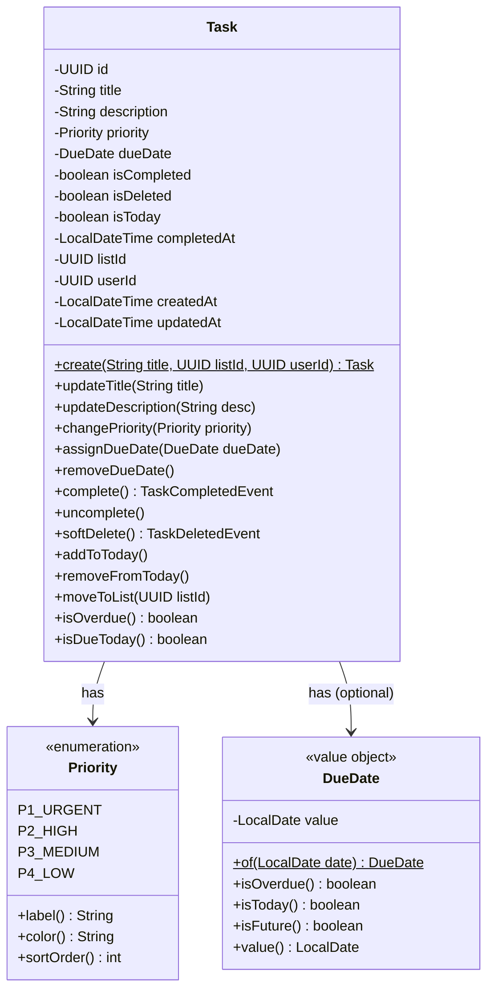
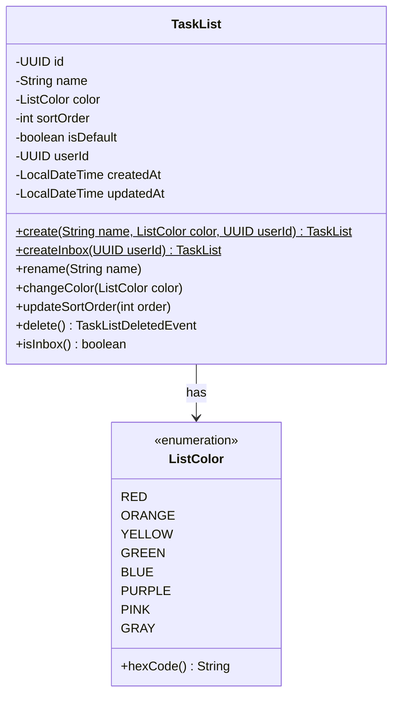
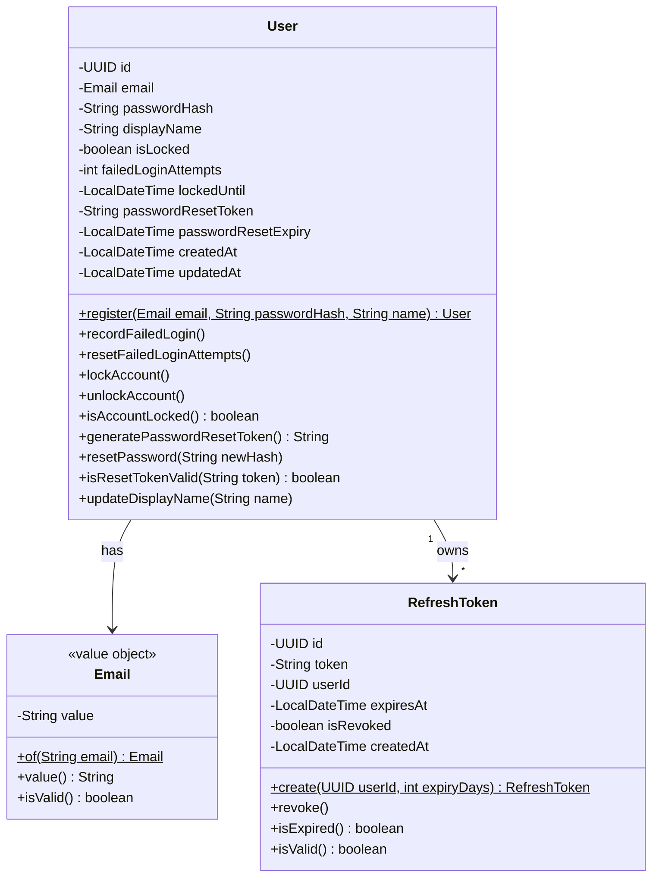
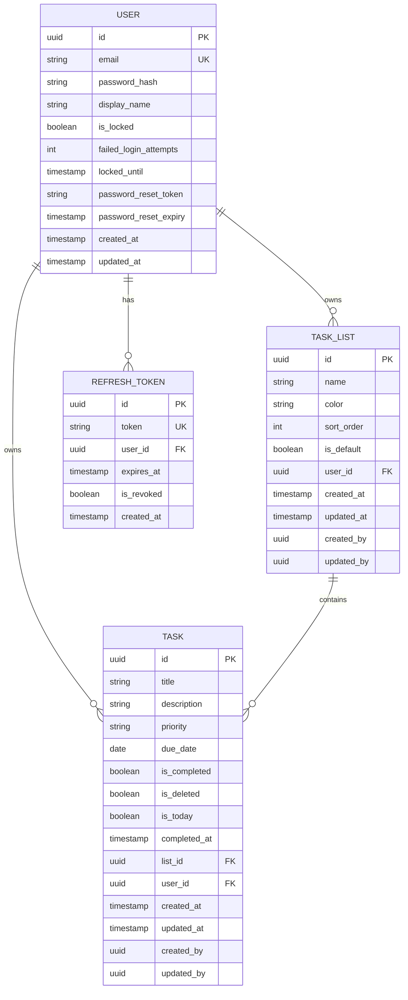

# Clarity (todo-app) -- Low-Level Design: Class Design

**Project:** todo-app
**Phase:** Design (LLD)
**Created:** 2026-03-07
**Status:** Draft
**Based on:** docs/architecture/hld/system-architecture.md, docs/prd/prd.md

---

## Table of Contents

1. [Backend Package Structure](#1-backend-package-structure)
2. [Frontend Structure](#2-frontend-structure)
3. [Class Diagrams](#3-class-diagrams)
4. [Interface Definitions](#4-interface-definitions)
5. [Design Patterns Applied](#5-design-patterns-applied)

---

## 1. Backend Package Structure

The backend follows a DDD layered architecture within a modular monolith. The primary bounded context is **Task Management**. Authentication is a separate module (not a full bounded context) sharing the same database and deployment unit.

```
backend/
├── src/main/java/com/clarity/
│   ├── ClarityApplication.java
│   │
│   ├── task/                                    # Task Management Bounded Context
│   │   ├── domain/
│   │   │   ├── model/
│   │   │   │   ├── Task.java                    # Aggregate Root
│   │   │   │   ├── TaskList.java                # Aggregate Root
│   │   │   │   ├── Priority.java                # Value Object (Enum: P1, P2, P3, P4)
│   │   │   │   ├── DueDate.java                 # Value Object (wraps LocalDate)
│   │   │   │   └── ListColor.java               # Value Object (Enum: 8 preset colors)
│   │   │   ├── event/
│   │   │   │   ├── DomainEvent.java             # Abstract base event
│   │   │   │   ├── TaskCreatedEvent.java
│   │   │   │   ├── TaskCompletedEvent.java
│   │   │   │   ├── TaskDeletedEvent.java
│   │   │   │   └── TaskListDeletedEvent.java
│   │   │   ├── repository/
│   │   │   │   ├── TaskRepository.java          # Port (interface)
│   │   │   │   └── TaskListRepository.java      # Port (interface)
│   │   │   ├── exception/
│   │   │   │   ├── TaskNotFoundException.java
│   │   │   │   ├── ListNotFoundException.java
│   │   │   │   ├── InboxUndeletableException.java
│   │   │   │   └── TaskTitleRequiredException.java
│   │   │   └── service/
│   │   │       └── TaskDomainService.java       # Cross-aggregate domain logic
│   │   │
│   │   ├── application/
│   │   │   ├── command/
│   │   │   │   ├── CreateTaskCommand.java       # Java record
│   │   │   │   ├── UpdateTaskCommand.java       # Java record
│   │   │   │   ├── CompleteTaskCommand.java     # Java record
│   │   │   │   ├── CreateListCommand.java       # Java record
│   │   │   │   └── UpdateListCommand.java       # Java record
│   │   │   ├── query/
│   │   │   │   ├── TaskQuery.java               # Java record (filters: listId, completed, priority, sort)
│   │   │   │   ├── TodayTaskQuery.java          # Java record (userId, includeOverdue)
│   │   │   │   └── TaskListQuery.java           # Java record (userId)
│   │   │   ├── service/
│   │   │   │   ├── TaskApplicationService.java  # Orchestrates task use cases
│   │   │   │   └── TaskListApplicationService.java # Orchestrates list use cases
│   │   │   └── mapper/
│   │   │       ├── TaskMapper.java              # MapStruct: domain <-> DTO
│   │   │       └── TaskListMapper.java          # MapStruct: domain <-> DTO
│   │   │
│   │   ├── infrastructure/
│   │   │   ├── persistence/
│   │   │   │   ├── TaskJpaEntity.java           # JPA @Entity
│   │   │   │   ├── TaskListJpaEntity.java       # JPA @Entity
│   │   │   │   ├── SpringDataTaskRepository.java     # Spring Data JPA interface
│   │   │   │   ├── SpringDataTaskListRepository.java # Spring Data JPA interface
│   │   │   │   ├── JpaTaskRepository.java       # Adapter (implements TaskRepository port)
│   │   │   │   └── JpaTaskListRepository.java   # Adapter (implements TaskListRepository port)
│   │   │   ├── cache/
│   │   │   │   └── TaskCacheManager.java        # Redis cache-aside for task queries
│   │   │   └── config/
│   │   │       └── TaskModuleConfig.java        # Spring @Configuration for task module
│   │   │
│   │   └── api/
│   │       ├── controller/
│   │       │   ├── TaskController.java          # REST endpoints for /api/v1/tasks
│   │       │   └── TaskListController.java      # REST endpoints for /api/v1/lists
│   │       ├── dto/
│   │       │   ├── CreateTaskRequest.java       # Java record + Bean Validation
│   │       │   ├── UpdateTaskRequest.java       # Java record + Bean Validation
│   │       │   ├── TaskResponse.java            # Java record
│   │       │   ├── TodayViewResponse.java       # Java record (groups: today, overdue, done)
│   │       │   ├── CreateListRequest.java       # Java record + Bean Validation
│   │       │   ├── UpdateListRequest.java       # Java record + Bean Validation
│   │       │   ├── TaskListResponse.java        # Java record
│   │       │   └── ListCountResponse.java       # Java record (listId, activeTaskCount)
│   │       └── advice/
│   │           └── TaskExceptionHandler.java    # @ControllerAdvice for task exceptions
│   │
│   ├── auth/                                    # Authentication Module
│   │   ├── domain/
│   │   │   ├── model/
│   │   │   │   ├── User.java                    # Entity
│   │   │   │   ├── Email.java                   # Value Object
│   │   │   │   └── RefreshToken.java            # Entity
│   │   │   ├── event/
│   │   │   │   └── UserRegisteredEvent.java
│   │   │   ├── repository/
│   │   │   │   ├── UserRepository.java          # Port (interface)
│   │   │   │   └── RefreshTokenRepository.java  # Port (interface)
│   │   │   └── exception/
│   │   │       ├── AccountLockedException.java
│   │   │       ├── InvalidCredentialsException.java
│   │   │       ├── EmailAlreadyExistsException.java
│   │   │       └── TokenExpiredException.java
│   │   │
│   │   ├── application/
│   │   │   └── service/
│   │   │       └── AuthApplicationService.java  # Orchestrates auth use cases
│   │   │
│   │   ├── infrastructure/
│   │   │   ├── persistence/
│   │   │   │   ├── UserJpaEntity.java           # JPA @Entity
│   │   │   │   ├── RefreshTokenJpaEntity.java   # JPA @Entity
│   │   │   │   ├── SpringDataUserRepository.java
│   │   │   │   ├── SpringDataRefreshTokenRepository.java
│   │   │   │   ├── JpaUserRepository.java       # Adapter (implements UserRepository port)
│   │   │   │   └── JpaRefreshTokenRepository.java # Adapter
│   │   │   ├── security/
│   │   │   │   ├── JwtTokenProvider.java        # JWT generation and validation
│   │   │   │   ├── JwtAuthenticationFilter.java # OncePerRequestFilter
│   │   │   │   └── SecurityConfig.java          # @EnableWebSecurity configuration
│   │   │   └── token/
│   │   │       └── RedisTokenBlacklistService.java # Token blacklist in Redis
│   │   │
│   │   └── api/
│   │       ├── controller/
│   │       │   └── AuthController.java          # REST endpoints for /api/v1/auth
│   │       └── dto/
│   │           ├── LoginRequest.java            # Java record + Bean Validation
│   │           ├── RegisterRequest.java         # Java record + Bean Validation
│   │           ├── AuthResponse.java            # Java record (accessToken, refreshToken, expiresIn)
│   │           ├── RefreshRequest.java          # Java record
│   │           ├── ForgotPasswordRequest.java   # Java record + Bean Validation
│   │           └── ResetPasswordRequest.java    # Java record + Bean Validation
│   │
│   └── shared/                                  # Shared Kernel
│       ├── domain/
│       │   ├── BaseEntity.java                  # Abstract: id (UUID), equals, hashCode
│       │   └── AuditableEntity.java             # Extends BaseEntity: createdAt, updatedAt, createdBy, updatedBy
│       ├── config/
│       │   ├── CorsConfig.java                  # CORS configuration
│       │   ├── RedisConfig.java                 # Redis connection and template
│       │   └── WebMvcConfig.java                # General MVC configuration
│       ├── exception/
│       │   ├── GlobalExceptionHandler.java      # @ControllerAdvice: catches all unhandled exceptions
│       │   └── ErrorResponse.java               # Java record: status, code, message, details, timestamp, traceId
│       └── audit/
│           └── AuditingConfig.java              # Spring Data JPA auditing enablement
```

### Package Dependency Rules

| Package | May Depend On | Must NOT Depend On |
|---------|---------------|-------------------|
| `task.domain` | `shared.domain` (base classes only) | `application`, `infrastructure`, `api`, Spring, JPA, any framework |
| `task.application` | `task.domain`, `shared.domain` | `infrastructure`, `api` |
| `task.infrastructure` | `task.domain`, `shared.domain`, Spring, JPA, Redis | `application`, `api` |
| `task.api` | `task.application`, `shared.exception`, Spring Web | `task.domain` (except mappers), `task.infrastructure` |
| `auth.domain` | `shared.domain` | Same isolation as `task.domain` |
| `auth.application` | `auth.domain`, `shared.domain` | `infrastructure`, `api` |
| `auth.infrastructure` | `auth.domain`, `shared.domain`, Spring Security | `application`, `api` |
| `auth.api` | `auth.application`, `shared.exception`, Spring Web | `auth.domain`, `auth.infrastructure` |

These rules are enforced by an ArchUnit test in `src/test/java/com/clarity/architecture/ArchitectureTest.java`.

---

## 2. Frontend Structure

The frontend follows Angular 17+ conventions with standalone components, NgRx for state management, and lazy-loaded feature modules.

```
frontend/
├── src/
│   ├── app/
│   │   ├── app.component.ts                      # Root component
│   │   ├── app.component.html
│   │   ├── app.routes.ts                          # Root route configuration
│   │   ├── app.config.ts                          # Application providers (NgRx, HTTP, Router)
│   │   │
│   │   ├── core/                                  # Singleton services, guards, interceptors
│   │   │   ├── auth/
│   │   │   │   ├── auth.service.ts                # Login, register, logout, refresh HTTP calls
│   │   │   │   ├── auth.guard.ts                  # CanActivate: redirects to /login if unauthenticated
│   │   │   │   ├── auth.interceptor.ts            # Attaches JWT Bearer token to all /api requests
│   │   │   │   └── token-storage.service.ts       # In-memory token storage (not localStorage)
│   │   │   ├── services/
│   │   │   │   ├── task.service.ts                # HTTP calls to /api/v1/tasks
│   │   │   │   ├── list.service.ts                # HTTP calls to /api/v1/lists
│   │   │   │   └── notification.service.ts        # Browser Notification API wrapper
│   │   │   ├── interceptors/
│   │   │   │   └── error.interceptor.ts           # Global HTTP error handling (401, 403, 500)
│   │   │   └── models/
│   │   │       ├── task.model.ts                  # Task interface and enums
│   │   │       ├── task-list.model.ts             # TaskList interface
│   │   │       ├── user.model.ts                  # User interface
│   │   │       ├── api-error.model.ts             # ErrorResponse interface
│   │   │       └── pagination.model.ts            # Page, Pageable interfaces
│   │   │
│   │   ├── shared/                                # Reusable presentational components
│   │   │   ├── components/
│   │   │   │   ├── toast/
│   │   │   │   │   ├── toast.component.ts         # Undo toast with countdown timer
│   │   │   │   │   └── toast.component.html
│   │   │   │   ├── priority-indicator/
│   │   │   │   │   ├── priority-indicator.component.ts   # Color-coded P1-P4 dot + dropdown
│   │   │   │   │   └── priority-indicator.component.html
│   │   │   │   ├── date-display/
│   │   │   │   │   ├── date-display.component.ts  # Due date with overdue/today/future coloring
│   │   │   │   │   └── date-display.component.html
│   │   │   │   ├── collapsible-section/
│   │   │   │   │   ├── collapsible-section.component.ts  # Expand/collapse with count badge
│   │   │   │   │   └── collapsible-section.component.html
│   │   │   │   ├── color-picker/
│   │   │   │   │   ├── color-picker.component.ts  # 8 preset color swatches
│   │   │   │   │   └── color-picker.component.html
│   │   │   │   ├── progress-counter/
│   │   │   │   │   ├── progress-counter.component.ts  # "X of Y completed" display
│   │   │   │   │   └── progress-counter.component.html
│   │   │   │   ├── confirm-dialog/
│   │   │   │   │   ├── confirm-dialog.component.ts
│   │   │   │   │   └── confirm-dialog.component.html
│   │   │   │   └── empty-state/
│   │   │   │       ├── empty-state.component.ts   # "No tasks" placeholder
│   │   │   │       └── empty-state.component.html
│   │   │   ├── pipes/
│   │   │   │   ├── relative-time.pipe.ts          # "2 hours ago", "Mar 5, 2026"
│   │   │   │   └── overdue-class.pipe.ts          # Returns CSS class: 'overdue', 'today', 'future'
│   │   │   └── directives/
│   │   │       └── keyboard-shortcut.directive.ts # Binds global keyboard shortcuts
│   │   │
│   │   ├── features/                              # Feature modules (lazy loaded)
│   │   │   ├── auth/
│   │   │   │   ├── login/
│   │   │   │   │   ├── login.component.ts         # Smart component: login form
│   │   │   │   │   └── login.component.html
│   │   │   │   ├── register/
│   │   │   │   │   ├── register.component.ts      # Smart component: registration form
│   │   │   │   │   └── register.component.html
│   │   │   │   ├── forgot-password/
│   │   │   │   │   ├── forgot-password.component.ts
│   │   │   │   │   └── forgot-password.component.html
│   │   │   │   ├── reset-password/
│   │   │   │   │   ├── reset-password.component.ts
│   │   │   │   │   └── reset-password.component.html
│   │   │   │   └── auth.routes.ts                 # Lazy routes for /auth/*
│   │   │   │
│   │   │   ├── tasks/
│   │   │   │   ├── task-list-view/
│   │   │   │   │   ├── task-list-view.component.ts      # Smart: fetches and displays tasks for a list
│   │   │   │   │   └── task-list-view.component.html
│   │   │   │   ├── task-item/
│   │   │   │   │   ├── task-item.component.ts           # Presentational: single task row
│   │   │   │   │   └── task-item.component.html
│   │   │   │   ├── task-detail-panel/
│   │   │   │   │   ├── task-detail-panel.component.ts   # Smart: side panel for editing a task
│   │   │   │   │   └── task-detail-panel.component.html
│   │   │   │   ├── task-creation/
│   │   │   │   │   ├── task-creation.component.ts       # Presentational: inline input for new task
│   │   │   │   │   └── task-creation.component.html
│   │   │   │   ├── sort-toggle/
│   │   │   │   │   ├── sort-toggle.component.ts         # Presentational: sort by priority/date
│   │   │   │   │   └── sort-toggle.component.html
│   │   │   │   ├── store/
│   │   │   │   │   ├── task.actions.ts                  # [Task] Load Tasks, Create Task, etc.
│   │   │   │   │   ├── task.reducer.ts                  # State mutations
│   │   │   │   │   ├── task.selectors.ts                # selectAllTasks, selectTaskById, etc.
│   │   │   │   │   ├── task.effects.ts                  # HTTP side effects
│   │   │   │   │   └── task.state.ts                    # TaskState interface
│   │   │   │   └── tasks.routes.ts
│   │   │   │
│   │   │   ├── today/
│   │   │   │   ├── today-view/
│   │   │   │   │   ├── today-view.component.ts          # Smart: default landing page
│   │   │   │   │   └── today-view.component.html
│   │   │   │   ├── overdue-section/
│   │   │   │   │   ├── overdue-section.component.ts     # Presentational: collapsible overdue list
│   │   │   │   │   └── overdue-section.component.html
│   │   │   │   ├── done-today-section/
│   │   │   │   │   ├── done-today-section.component.ts  # Presentational: completed today list
│   │   │   │   │   └── done-today-section.component.html
│   │   │   │   ├── store/
│   │   │   │   │   ├── today.actions.ts
│   │   │   │   │   ├── today.reducer.ts
│   │   │   │   │   ├── today.selectors.ts
│   │   │   │   │   ├── today.effects.ts
│   │   │   │   │   └── today.state.ts
│   │   │   │   └── today.routes.ts
│   │   │   │
│   │   │   └── lists/
│   │   │       ├── sidebar/
│   │   │       │   ├── sidebar.component.ts             # Smart: sidebar with list navigation
│   │   │       │   └── sidebar.component.html
│   │   │       ├── list-form/
│   │   │       │   ├── list-form.component.ts           # Presentational: create/edit list form
│   │   │       │   └── list-form.component.html
│   │   │       ├── list-item/
│   │   │       │   ├── list-item.component.ts           # Presentational: single list row in sidebar
│   │   │       │   └── list-item.component.html
│   │   │       ├── store/
│   │   │       │   ├── list.actions.ts
│   │   │       │   ├── list.reducer.ts
│   │   │       │   ├── list.selectors.ts
│   │   │       │   ├── list.effects.ts
│   │   │       │   └── list.state.ts
│   │   │       └── lists.routes.ts
│   │   │
│   │   └── layouts/
│   │       ├── main-layout/
│   │       │   ├── main-layout.component.ts       # Sidebar + content area + toolbar
│   │       │   └── main-layout.component.html
│   │       └── auth-layout/
│   │           ├── auth-layout.component.ts       # Centered card layout for auth pages
│   │           └── auth-layout.component.html
│   │
│   ├── environments/
│   │   ├── environment.ts                         # Dev: apiUrl = '/api/v1'
│   │   └── environment.prod.ts                    # Prod: apiUrl = '/api/v1'
│   │
│   ├── styles.scss                                # Global styles, Tailwind imports
│   └── proxy.conf.json                            # Dev proxy: /api/* -> localhost:8080
│
├── angular.json
├── tsconfig.json
├── tailwind.config.js
└── package.json
```

### Frontend Component Classification

| Component | Type | Location | Role |
|-----------|------|----------|------|
| `TodayViewComponent` | Smart (Container) | `features/today/today-view/` | Dispatches NgRx actions, subscribes to selectors, manages today view |
| `OverdueSectionComponent` | Presentational | `features/today/overdue-section/` | Receives overdue tasks via `@Input()`, emits reschedule via `@Output()` |
| `DoneTodaySectionComponent` | Presentational | `features/today/done-today-section/` | Receives completed tasks via `@Input()` |
| `TaskListViewComponent` | Smart (Container) | `features/tasks/task-list-view/` | Dispatches load, handles filters and sorting |
| `TaskItemComponent` | Presentational | `features/tasks/task-item/` | Receives single task via `@Input()`, emits click/complete/delete via `@Output()` |
| `TaskDetailPanelComponent` | Smart (Container) | `features/tasks/task-detail-panel/` | Fetches selected task, dispatches updates |
| `TaskCreationComponent` | Presentational | `features/tasks/task-creation/` | Inline text input, emits `@Output()` on Enter |
| `SortToggleComponent` | Presentational | `features/tasks/sort-toggle/` | Receives current sort, emits sort change |
| `SidebarComponent` | Smart (Container) | `features/lists/sidebar/` | Fetches lists + counts, dispatches selection |
| `ListFormComponent` | Presentational | `features/lists/list-form/` | Name + color form, emits save |
| `ListItemComponent` | Presentational | `features/lists/list-item/` | Single list row with count badge |
| `LoginComponent` | Smart (Container) | `features/auth/login/` | Manages login form, calls AuthService |
| `RegisterComponent` | Smart (Container) | `features/auth/register/` | Manages registration form |
| `ToastComponent` | Presentational | `shared/components/toast/` | Receives message + action, emits action click |
| `PriorityIndicatorComponent` | Presentational | `shared/components/priority-indicator/` | Receives priority, emits change |
| `CollapsibleSectionComponent` | Presentational | `shared/components/collapsible-section/` | Generic expand/collapse container |
| `MainLayoutComponent` | Layout | `layouts/main-layout/` | Sidebar + router-outlet + toolbar |
| `AuthLayoutComponent` | Layout | `layouts/auth-layout/` | Centered card + router-outlet |

---

## 3. Class Diagrams

### 3.1 Task Aggregate Root

#### ASCII Diagram

```
┌──────────────────────────────────────────────┐
│                    Task                       │
│              (Aggregate Root)                 │
├──────────────────────────────────────────────┤
│ - id: UUID                                    │
│ - title: String (1..255)                      │
│ - description: String (0..2000)               │
│ - priority: Priority                          │
│ - dueDate: DueDate (nullable)                 │
│ - isCompleted: boolean                        │
│ - isDeleted: boolean                          │
│ - isToday: boolean                            │
│ - completedAt: LocalDateTime (nullable)       │
│ - listId: UUID (reference by ID)              │
│ - userId: UUID (reference by ID)              │
│ - createdAt: LocalDateTime                    │
│ - updatedAt: LocalDateTime                    │
│ - createdBy: UUID                             │
│ - updatedBy: UUID                             │
├──────────────────────────────────────────────┤
│ + create(title, listId, userId): Task         │
│ + updateTitle(title): void                    │
│ + updateDescription(desc): void               │
│ + changePriority(priority): void              │
│ + assignDueDate(dueDate): void                │
│ + removeDueDate(): void                       │
│ + complete(): TaskCompletedEvent              │
│ + uncomplete(): void                          │
│ + softDelete(): TaskDeletedEvent              │
│ + addToToday(): void                          │
│ + removeFromToday(): void                     │
│ + moveToList(listId): void                    │
│ + isOverdue(): boolean                        │
│ + isDueToday(): boolean                       │
└──────────────────────────────────────────────┘
         │ uses               │ uses
         ▼                    ▼
┌─────────────────┐  ┌─────────────────────┐
│    Priority     │  │      DueDate        │
│  (Value Object) │  │   (Value Object)    │
├─────────────────┤  ├─────────────────────┤
│ P1 (Urgent/Red) │  │ - value: LocalDate  │
│ P2 (High/Orange)│  ├─────────────────────┤
│ P3 (Medium/Blue)│  │ + of(date): DueDate │
│ P4 (Low/Gray)   │  │ + isOverdue(): bool │
├─────────────────┤  │ + isToday(): bool   │
│ + label(): Str  │  │ + isFuture(): bool  │
│ + color(): Str  │  │ + value(): LocDate  │
│ + sortOrder():int│  └─────────────────────┘
└─────────────────┘
```

#### Mermaid Diagram



See standalone file: `docs/architecture/lld/diagrams/class-diagram.mmd`

### 3.2 TaskList Aggregate Root

#### ASCII Diagram

```
┌──────────────────────────────────────────────┐
│                  TaskList                      │
│              (Aggregate Root)                  │
├──────────────────────────────────────────────┤
│ - id: UUID                                    │
│ - name: String (1..50)                        │
│ - color: ListColor                            │
│ - sortOrder: int                              │
│ - isDefault: boolean                          │
│ - userId: UUID (reference by ID)              │
│ - createdAt: LocalDateTime                    │
│ - updatedAt: LocalDateTime                    │
│ - createdBy: UUID                             │
│ - updatedBy: UUID                             │
├──────────────────────────────────────────────┤
│ + create(name, color, userId): TaskList       │
│ + createInbox(userId): TaskList               │
│ + rename(name): void                          │
│ + changeColor(color): void                    │
│ + updateSortOrder(order): void                │
│ + delete(): TaskListDeletedEvent              │
│ + isInbox(): boolean                          │
└──────────────────────────────────────────────┘
         │ uses
         ▼
┌─────────────────────┐
│     ListColor       │
│  (Value Object)     │
├─────────────────────┤
│ RED                 │
│ ORANGE              │
│ YELLOW              │
│ GREEN               │
│ BLUE                │
│ PURPLE              │
│ PINK                │
│ GRAY                │
├─────────────────────┤
│ + hexCode(): String │
└─────────────────────┘
```

#### Mermaid Diagram



### 3.3 User Entity

#### ASCII Diagram

```
┌──────────────────────────────────────────────┐
│                    User                       │
│                 (Entity)                      │
├──────────────────────────────────────────────┤
│ - id: UUID                                    │
│ - email: Email                                │
│ - passwordHash: String                        │
│ - displayName: String (1..100)                │
│ - isLocked: boolean                           │
│ - failedLoginAttempts: int                    │
│ - lockedUntil: LocalDateTime (nullable)       │
│ - passwordResetToken: String (nullable)       │
│ - passwordResetExpiry: LocalDateTime (nullable)│
│ - createdAt: LocalDateTime                    │
│ - updatedAt: LocalDateTime                    │
├──────────────────────────────────────────────┤
│ + register(email, passwordHash, name): User   │
│ + recordFailedLogin(): void                   │
│ + resetFailedLoginAttempts(): void            │
│ + lockAccount(): void                         │
│ + unlockAccount(): void                       │
│ + isAccountLocked(): boolean                  │
│ + generatePasswordResetToken(): String        │
│ + resetPassword(newHash): void                │
│ + isResetTokenValid(token): boolean           │
│ + updateDisplayName(name): void               │
└──────────────────────────────────────────────┘
         │ uses
         ▼
┌─────────────────────┐
│       Email         │
│  (Value Object)     │
├─────────────────────┤
│ - value: String     │
├─────────────────────┤
│ + of(email): Email  │
│ + value(): String   │
│ + isValid(): bool   │
└─────────────────────┘
```

#### Mermaid Diagram



### 3.4 Full Domain Model Relationship Diagram

#### ASCII Diagram

```
                        ┌──────────────┐
                        │     User     │
                        │   (Entity)   │
                        └──────┬───────┘
                               │
               ┌───────────────┼───────────────┐
               │ owns          │ owns           │ owns
               ▼               ▼                ▼
      ┌──────────────┐  ┌──────────────┐  ┌──────────────────┐
      │   TaskList   │  │     Task     │  │  RefreshToken    │
      │ (Aggregate)  │  │ (Aggregate)  │  │  (Entity)        │
      └──────┬───────┘  └──────┬───────┘  └──────────────────┘
             │                 │
             │ has many        │ belongs to
             │◄────────────────┘ (by listId)
             │
             │ uses            Task uses:
             ▼                 ├── Priority (VO)
      ┌──────────────┐        ├── DueDate (VO)
      │  ListColor   │        │
      │  (VO/Enum)   │        User uses:
      └──────────────┘        └── Email (VO)

  ┌──────────────────────────────────────────────────┐
  │              Domain Events                        │
  ├──────────────────────────────────────────────────┤
  │  UserRegisteredEvent  → triggers Inbox creation   │
  │  TaskCreatedEvent     → triggers cache invalidation│
  │  TaskCompletedEvent   → triggers cache invalidation│
  │  TaskDeletedEvent     → triggers cache invalidation│
  │  TaskListDeletedEvent → triggers task migration    │
  └──────────────────────────────────────────────────┘
```

#### Mermaid Diagram



---

## 4. Interface Definitions

### 4.1 Domain Repository Interfaces (Ports)

These interfaces live in the domain layer and have zero framework dependencies. They are implemented by adapters in the infrastructure layer.

#### TaskRepository

```java
package com.clarity.task.domain.repository;

import com.clarity.task.domain.model.Task;
import com.clarity.task.domain.model.Priority;
import java.time.LocalDate;
import java.util.List;
import java.util.Optional;
import java.util.UUID;

public interface TaskRepository {

    Task save(Task task);

    Optional<Task> findById(UUID id);

    Optional<Task> findByIdAndUserId(UUID id, UUID userId);

    List<Task> findByUserIdAndListId(UUID userId, UUID listId,
                                      boolean includeCompleted,
                                      String sortBy, String sortDirection,
                                      int page, int size);

    List<Task> findTodayTasks(UUID userId, LocalDate today);

    List<Task> findOverdueTasks(UUID userId, LocalDate today);

    List<Task> findCompletedTodayTasks(UUID userId, LocalDate today);

    long countActiveByListId(UUID listId, UUID userId);

    void softDelete(UUID id, UUID userId);

    List<Task> findByListId(UUID listId);

    void moveTasksToList(UUID fromListId, UUID toListId, UUID userId);
}
```

#### TaskListRepository

```java
package com.clarity.task.domain.repository;

import com.clarity.task.domain.model.TaskList;
import java.util.List;
import java.util.Optional;
import java.util.UUID;

public interface TaskListRepository {

    TaskList save(TaskList taskList);

    Optional<TaskList> findById(UUID id);

    Optional<TaskList> findByIdAndUserId(UUID id, UUID userId);

    List<TaskList> findByUserId(UUID userId);

    Optional<TaskList> findDefaultByUserId(UUID userId);

    void delete(UUID id);

    boolean existsByNameAndUserId(String name, UUID userId);
}
```

#### UserRepository

```java
package com.clarity.auth.domain.repository;

import com.clarity.auth.domain.model.User;
import com.clarity.auth.domain.model.Email;
import java.util.Optional;
import java.util.UUID;

public interface UserRepository {

    User save(User user);

    Optional<User> findById(UUID id);

    Optional<User> findByEmail(Email email);

    boolean existsByEmail(Email email);
}
```

#### RefreshTokenRepository

```java
package com.clarity.auth.domain.repository;

import com.clarity.auth.domain.model.RefreshToken;
import java.util.Optional;
import java.util.UUID;

public interface RefreshTokenRepository {

    RefreshToken save(RefreshToken token);

    Optional<RefreshToken> findByToken(String token);

    void revokeAllByUserId(UUID userId);

    void deleteExpired();
}
```

### 4.2 Application Service Interfaces

Application services orchestrate use cases. They are the entry point for the API layer.

#### TaskApplicationService

```java
package com.clarity.task.application.service;

import com.clarity.task.application.command.*;
import com.clarity.task.application.query.*;

public class TaskApplicationService {

    // Commands (write operations)
    public TaskResponse createTask(CreateTaskCommand command) { ... }
    public TaskResponse updateTask(UUID taskId, UpdateTaskCommand command) { ... }
    public TaskResponse completeTask(UUID taskId, UUID userId) { ... }
    public TaskResponse uncompleteTask(UUID taskId, UUID userId) { ... }
    public void deleteTask(UUID taskId, UUID userId) { ... }
    public TaskResponse toggleToday(UUID taskId, UUID userId) { ... }
    public TaskResponse moveToList(UUID taskId, UUID listId, UUID userId) { ... }

    // Queries (read operations)
    public Page<TaskResponse> getTasks(TaskQuery query) { ... }
    public TaskResponse getTaskById(UUID taskId, UUID userId) { ... }
    public TodayViewResponse getTodayView(UUID userId) { ... }
}
```

#### TaskListApplicationService

```java
package com.clarity.task.application.service;

import com.clarity.task.application.command.*;
import com.clarity.task.application.query.*;

public class TaskListApplicationService {

    public TaskListResponse createList(CreateListCommand command) { ... }
    public TaskListResponse updateList(UUID listId, UpdateListCommand command) { ... }
    public void deleteList(UUID listId, UUID userId) { ... }
    public List<TaskListResponse> getListsByUser(UUID userId) { ... }
    public List<ListCountResponse> getListCounts(UUID userId) { ... }
    public void createDefaultInbox(UUID userId) { ... }
}
```

#### AuthApplicationService

```java
package com.clarity.auth.application.service;

public class AuthApplicationService {

    public AuthResponse register(RegisterRequest request) { ... }
    public AuthResponse login(LoginRequest request) { ... }
    public void logout(String refreshToken) { ... }
    public AuthResponse refresh(String refreshToken) { ... }
    public void forgotPassword(String email) { ... }
    public void resetPassword(String token, String newPassword) { ... }
}
```

### 4.3 Command and Query Records

```java
// --- Commands (Java records, immutable) ---

public record CreateTaskCommand(
    String title,
    String description,        // optional
    Priority priority,         // optional, defaults to P4
    LocalDate dueDate,         // optional
    UUID listId,               // optional, defaults to Inbox
    UUID userId
) {}

public record UpdateTaskCommand(
    String title,              // optional (only update if non-null)
    String description,        // optional
    Priority priority,         // optional
    LocalDate dueDate,         // optional
    UUID listId,               // optional
    UUID userId
) {}

public record CompleteTaskCommand(
    UUID taskId,
    UUID userId
) {}

public record CreateListCommand(
    String name,
    ListColor color,           // optional, defaults to GRAY
    UUID userId
) {}

public record UpdateListCommand(
    String name,               // optional
    ListColor color,           // optional
    UUID userId
) {}

// --- Queries (Java records, immutable) ---

public record TaskQuery(
    UUID userId,
    UUID listId,               // optional filter
    Boolean completed,         // optional filter
    Priority priority,         // optional filter
    String sortBy,             // "priority", "dueDate", "createdAt"
    String sortDirection,      // "asc", "desc"
    int page,                  // 0-indexed
    int size                   // default 50, max 200
) {}

public record TodayTaskQuery(
    UUID userId
) {}

public record TaskListQuery(
    UUID userId
) {}
```

### 4.4 API DTOs (Request/Response Records)

```java
// --- Request DTOs (Bean Validation) ---

public record CreateTaskRequest(
    @NotBlank(message = "Title is required")
    @Size(max = 255, message = "Title must not exceed 255 characters")
    String title,

    @Size(max = 2000, message = "Description must not exceed 2000 characters")
    String description,

    String priority,           // "P1", "P2", "P3", "P4"

    LocalDate dueDate,

    UUID listId
) {}

public record UpdateTaskRequest(
    @Size(max = 255, message = "Title must not exceed 255 characters")
    String title,

    @Size(max = 2000, message = "Description must not exceed 2000 characters")
    String description,

    String priority,

    LocalDate dueDate,

    UUID listId
) {}

public record CreateListRequest(
    @NotBlank(message = "List name is required")
    @Size(max = 50, message = "List name must not exceed 50 characters")
    String name,

    String color                // "RED", "ORANGE", etc.
) {}

public record UpdateListRequest(
    @Size(max = 50, message = "List name must not exceed 50 characters")
    String name,

    String color
) {}

public record RegisterRequest(
    @NotBlank(message = "Email is required")
    @Email(message = "Invalid email format")
    String email,

    @NotBlank(message = "Password is required")
    @Size(min = 8, message = "Password must be at least 8 characters")
    @Pattern(regexp = "^(?=.*[A-Z])(?=.*\\d).*$",
             message = "Password must contain at least 1 uppercase letter and 1 number")
    String password,

    @NotBlank(message = "Display name is required")
    @Size(max = 100, message = "Display name must not exceed 100 characters")
    String displayName
) {}

public record LoginRequest(
    @NotBlank(message = "Email is required")
    @Email(message = "Invalid email format")
    String email,

    @NotBlank(message = "Password is required")
    String password
) {}

public record RefreshRequest(
    @NotBlank(message = "Refresh token is required")
    String refreshToken
) {}

public record ForgotPasswordRequest(
    @NotBlank(message = "Email is required")
    @Email(message = "Invalid email format")
    String email
) {}

public record ResetPasswordRequest(
    @NotBlank(message = "Token is required")
    String token,

    @NotBlank(message = "New password is required")
    @Size(min = 8, message = "Password must be at least 8 characters")
    @Pattern(regexp = "^(?=.*[A-Z])(?=.*\\d).*$",
             message = "Password must contain at least 1 uppercase letter and 1 number")
    String newPassword
) {}

// --- Response DTOs ---

public record TaskResponse(
    UUID id,
    String title,
    String description,
    String priority,            // "P1", "P2", "P3", "P4"
    String priorityLabel,       // "Urgent", "High", "Medium", "Low"
    String priorityColor,       // "#EF4444", "#F97316", "#3B82F6", "#6B7280"
    LocalDate dueDate,
    boolean isCompleted,
    boolean isToday,
    LocalDateTime completedAt,
    UUID listId,
    String listName,
    LocalDateTime createdAt,
    LocalDateTime updatedAt
) {}

public record TodayViewResponse(
    List<TaskResponse> todayTasks,
    List<TaskResponse> overdueTasks,
    List<TaskResponse> doneTodayTasks,
    int totalToday,
    int completedToday
) {}

public record TaskListResponse(
    UUID id,
    String name,
    String color,               // "RED", "ORANGE", etc.
    String colorHex,            // "#EF4444"
    int sortOrder,
    boolean isDefault,
    LocalDateTime createdAt,
    LocalDateTime updatedAt
) {}

public record ListCountResponse(
    UUID listId,
    String listName,
    long activeTaskCount
) {}

public record AuthResponse(
    String accessToken,
    String refreshToken,
    long expiresIn,             // seconds until access token expiry
    String tokenType            // "Bearer"
) {}
```

### 4.5 Domain Event Definitions

```java
// Base event
public abstract class DomainEvent {
    private final UUID eventId;
    private final LocalDateTime occurredAt;

    protected DomainEvent() {
        this.eventId = UUID.randomUUID();
        this.occurredAt = LocalDateTime.now(Clock.systemUTC());
    }

    public UUID getEventId() { return eventId; }
    public LocalDateTime getOccurredAt() { return occurredAt; }
}

// Events
public class TaskCreatedEvent extends DomainEvent {
    private final UUID taskId;
    private final UUID userId;
    private final UUID listId;
    // constructor, getters
}

public class TaskCompletedEvent extends DomainEvent {
    private final UUID taskId;
    private final UUID userId;
    // constructor, getters
}

public class TaskDeletedEvent extends DomainEvent {
    private final UUID taskId;
    private final UUID userId;
    private final UUID listId;
    // constructor, getters
}

public class TaskListDeletedEvent extends DomainEvent {
    private final UUID listId;
    private final UUID userId;
    // constructor, getters
}

public class UserRegisteredEvent extends DomainEvent {
    private final UUID userId;
    private final String email;
    // constructor, getters
}
```

### 4.6 Shared Base Classes

```java
// BaseEntity -- identity and equality
@MappedSuperclass
public abstract class BaseEntity {
    @Id
    private UUID id;

    protected BaseEntity() {
        this.id = UUID.randomUUID();
    }

    public UUID getId() { return id; }

    @Override
    public boolean equals(Object o) {
        if (this == o) return true;
        if (o == null || getClass() != o.getClass()) return false;
        BaseEntity that = (BaseEntity) o;
        return id.equals(that.id);
    }

    @Override
    public int hashCode() { return id.hashCode(); }
}

// AuditableEntity -- audit columns
@MappedSuperclass
@EntityListeners(AuditingEntityListener.class)
public abstract class AuditableEntity extends BaseEntity {
    @CreatedDate
    private LocalDateTime createdAt;

    @LastModifiedDate
    private LocalDateTime updatedAt;

    @CreatedBy
    private UUID createdBy;

    @LastModifiedBy
    private UUID updatedBy;

    // getters
}

// ErrorResponse -- standard error format
public record ErrorResponse(
    int status,
    String code,
    String message,
    List<FieldError> details,
    LocalDateTime timestamp,
    String traceId
) {
    public record FieldError(String field, String message) {}
}
```

### 4.7 MapStruct Mapper Interfaces

```java
@Mapper(componentModel = "spring")
public interface TaskMapper {

    TaskResponse toResponse(Task task, String listName);

    Task toDomain(CreateTaskCommand command);

    void updateDomainFromCommand(UpdateTaskCommand command, @MappingTarget Task task);
}

@Mapper(componentModel = "spring")
public interface TaskListMapper {

    TaskListResponse toResponse(TaskList list);

    TaskList toDomain(CreateListCommand command);
}
```

---

## 5. Design Patterns Applied

| Pattern | Where Used | Rationale |
|---------|-----------|-----------|
| **Aggregate Root** | `Task`, `TaskList` | Defines consistency boundaries. All state changes to a task go through the Task aggregate root. External entities (TaskList) are referenced by ID only, not by direct object reference. |
| **Value Object** | `Priority`, `DueDate`, `ListColor`, `Email` | Immutable objects with no identity. Equality is based on value, not reference. Encapsulate validation logic (e.g., `DueDate.isOverdue()`, `Email.isValid()`). |
| **Repository (Port/Adapter)** | `TaskRepository` (port in domain), `JpaTaskRepository` (adapter in infrastructure) | Decouples domain logic from persistence technology. The domain defines what it needs; infrastructure decides how to provide it. Enables testing with in-memory implementations. |
| **Factory Method** | `Task.create()`, `TaskList.createInbox()`, `User.register()` | Encapsulates creation logic and enforces invariants at construction time. Static factory methods replace complex constructors and ensure objects are always created in a valid state. |
| **Domain Event** | `TaskCreatedEvent`, `TaskCompletedEvent`, `UserRegisteredEvent` | Decouples side effects (cache invalidation, Inbox creation) from the core business operation. In MVP, events are dispatched in-process via Spring `ApplicationEventPublisher`. Future: Kafka/RabbitMQ. |
| **Command/Query Separation** | `CreateTaskCommand` (write), `TaskQuery` (read) | Commands mutate state and return confirmation. Queries read state without side effects. Separating them clarifies intent, simplifies testing, and prepares for CQRS if needed. |
| **DTO Pattern** | `CreateTaskRequest`, `TaskResponse`, `AuthResponse` | Separate API representation from domain model. DTOs are Java records (immutable). Prevents entity leakage through API boundaries. Enables independent versioning of API and domain. |
| **Mapper (MapStruct)** | `TaskMapper`, `TaskListMapper` | Compile-time code generation for DTO-to-domain and domain-to-DTO mapping. Eliminates manual boilerplate and reduces mapping bugs. Faster than reflection-based alternatives. |
| **Cache-Aside (Lazy Loading)** | `TaskCacheManager` | Read-through pattern: check Redis first, fall back to DB on miss, populate cache on read. Write path invalidates cache instead of updating it, avoiding stale data. |
| **Strategy (Implicit)** | Sort order in `TaskQuery` | Sort behavior changes based on the `sortBy` parameter (priority, dueDate, createdAt). The query consumer does not know the sorting implementation. |
| **Template Method (via Spring)** | `JwtAuthenticationFilter extends OncePerRequestFilter` | Spring's filter chain provides the template. The JWT filter overrides `doFilterInternal()` to add token extraction and validation logic. |
| **Builder (via Lombok)** | JPA entities (`TaskJpaEntity`, `UserJpaEntity`) | Entities with many fields use `@Builder` for readable construction in tests and infrastructure code. Domain models use factory methods instead. |
| **Observer (via Spring Events)** | `@EventListener` handlers for domain events | Loose coupling between event producers (aggregates) and consumers (cache invalidation, Inbox creation). Handlers are registered declaratively. |
| **Anti-Corruption Layer** | JPA entities vs. domain models | `TaskJpaEntity` (infrastructure) is separate from `Task` (domain). The adapter translates between them, preventing JPA annotations and Hibernate proxies from leaking into the domain layer. |
| **Interceptor** | Angular `AuthInterceptor`, `ErrorInterceptor` | Cross-cutting HTTP concerns (token attachment, error handling) are handled transparently by interceptors without modifying individual service calls. |
| **Guard** | Angular `AuthGuard` | Protects routes from unauthenticated access. Checks token validity before allowing navigation. Redirects to login if authentication is missing or expired. |

---

## Appendix: Aggregate Invariant Summary

### Task Aggregate Invariants

| ID | Invariant | Enforcement Location |
|----|-----------|---------------------|
| T-INV-01 | Title must not be blank and must not exceed 255 characters | `Task.create()`, `Task.updateTitle()` |
| T-INV-02 | Description must not exceed 2000 characters | `Task.updateDescription()` |
| T-INV-03 | Priority must be one of P1, P2, P3, P4 | `Priority` enum (type safety) |
| T-INV-04 | A task cannot be completed if already deleted | `Task.complete()` |
| T-INV-05 | A task cannot be deleted if already deleted | `Task.softDelete()` |
| T-INV-06 | `completedAt` is set when task is completed, cleared when uncompleted | `Task.complete()`, `Task.uncomplete()` |
| T-INV-07 | A task always belongs to exactly one list (via listId) | `Task.create()`, `Task.moveToList()` |
| T-INV-08 | A task always belongs to exactly one user (via userId) | `Task.create()` (set once, immutable) |

### TaskList Aggregate Invariants

| ID | Invariant | Enforcement Location |
|----|-----------|---------------------|
| L-INV-01 | Name must not be blank and must not exceed 50 characters | `TaskList.create()`, `TaskList.rename()` |
| L-INV-02 | The default Inbox list cannot be deleted | `TaskList.delete()` throws `InboxUndeletableException` |
| L-INV-03 | The default Inbox list cannot be renamed | `TaskList.rename()` checks `isDefault` flag |
| L-INV-04 | Color must be one of the 8 preset colors | `ListColor` enum (type safety) |
| L-INV-05 | A list always belongs to exactly one user | `TaskList.create()` (set once, immutable) |

### User Entity Invariants

| ID | Invariant | Enforcement Location |
|----|-----------|---------------------|
| U-INV-01 | Email must be a valid email format | `Email.of()` validates format |
| U-INV-02 | Password hash is never null after registration | `User.register()` |
| U-INV-03 | Account locks after 5 consecutive failed login attempts | `User.recordFailedLogin()` |
| U-INV-04 | Account lockout lasts exactly 15 minutes | `User.isAccountLocked()` checks `lockedUntil` against current time |
| U-INV-05 | Password reset token expires after 1 hour | `User.isResetTokenValid()` checks `passwordResetExpiry` |
| U-INV-06 | Successful login resets failed attempt counter | `User.resetFailedLoginAttempts()` |

---

*Generated by SDLC Factory -- Phase 4: Design (LLD - Class Design)*
*See also: `docs/architecture/lld/sequence-diagrams.md`, `docs/architecture/lld/api-contracts.md`*
