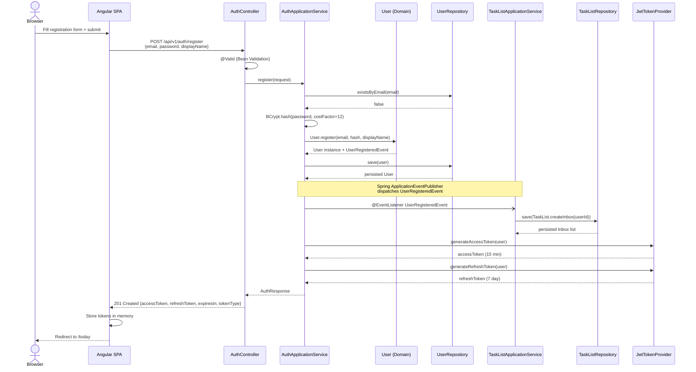
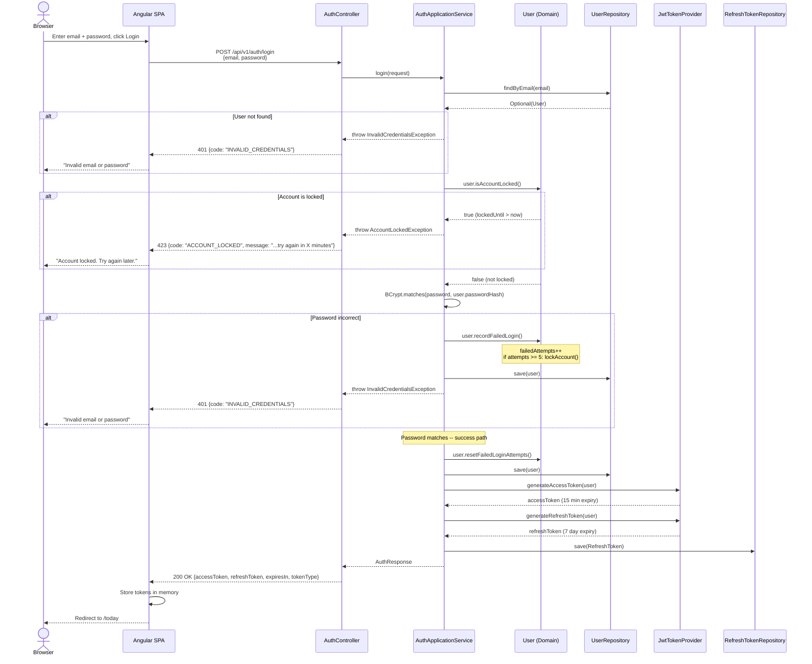
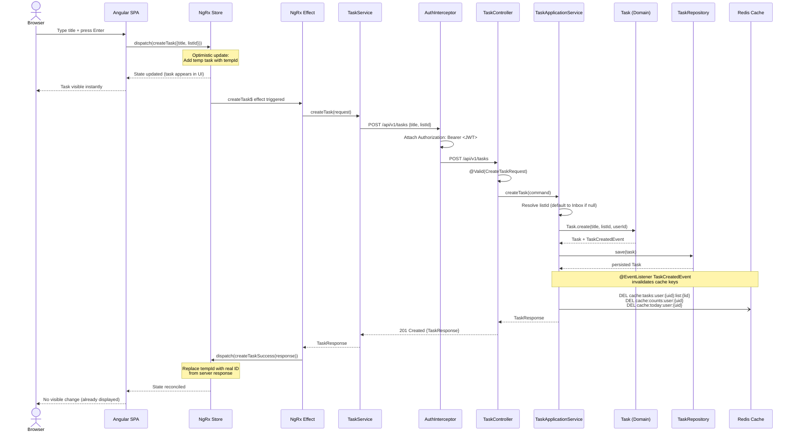
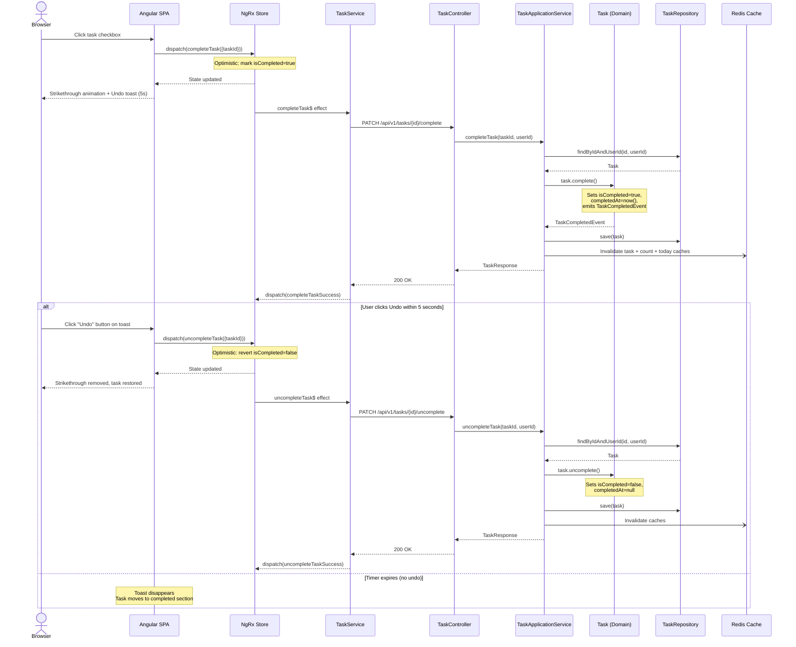
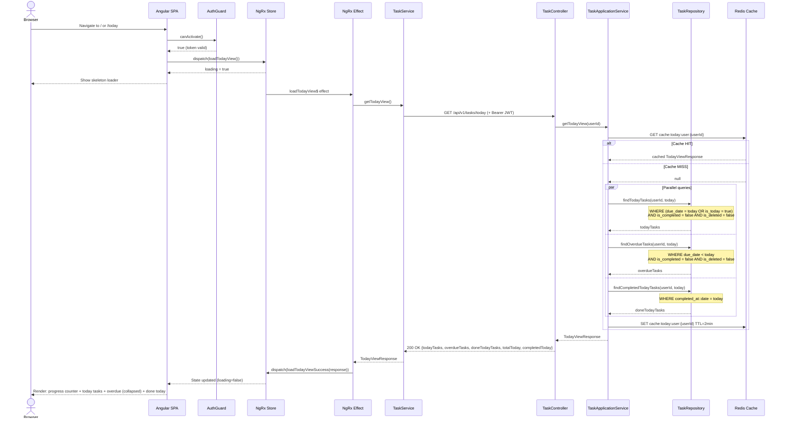
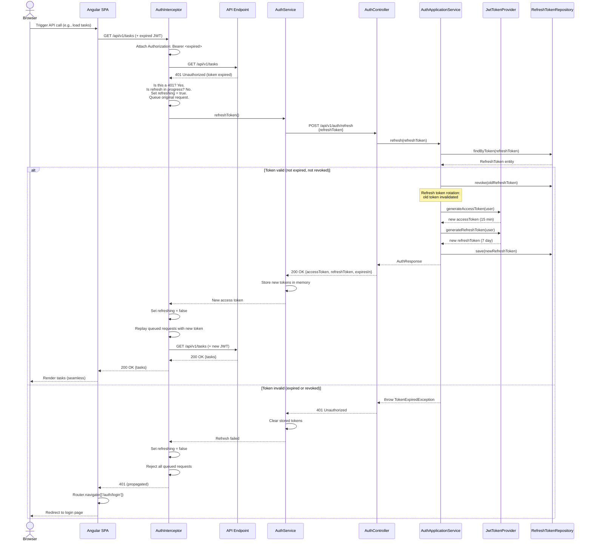

# Clarity (todo-app) -- Low-Level Design: Sequence Diagrams

**Project:** todo-app
**Phase:** Design (LLD)
**Created:** 2026-03-07
**Status:** Draft
**Based on:** docs/architecture/hld/system-architecture.md, docs/prd/prd.md, docs/architecture/lld/class-design.md

---

## Table of Contents

1. [User Registration](#1-user-registration)
2. [User Login](#2-user-login)
3. [Create Task](#3-create-task)
4. [Complete Task with Undo](#4-complete-task-with-undo)
5. [Today View Load](#5-today-view-load)
6. [Token Refresh](#6-token-refresh)

---

## 1. User Registration

**Use Case:** A new user registers with email, password, and display name. On success, a default "Inbox" task list is created via a domain event, and a JWT token pair is returned so the user is immediately logged in.

**Participants:** Browser, Angular SPA, AuthController, AuthApplicationService, User (domain), UserRepository, TaskListApplicationService, TaskListRepository, JwtTokenProvider, Redis

### ASCII Sequence Diagram

```
Browser          Angular SPA         AuthController      AuthAppService       User(domain)       UserRepo         TaskListAppSvc     TaskListRepo      JwtProvider       Redis
  │                  │                     │                   │                   │                  │                   │                  │                │              │
  │  Fill form       │                     │                   │                   │                  │                   │                  │                │              │
  │  + Submit        │                     │                   │                   │                  │                   │                  │                │              │
  │─────────────────>│                     │                   │                   │                  │                   │                  │                │              │
  │                  │                     │                   │                   │                  │                   │                  │                │              │
  │                  │  POST /api/v1/      │                   │                   │                  │                   │                  │                │              │
  │                  │  auth/register      │                   │                   │                  │                   │                  │                │              │
  │                  │  {email, password,  │                   │                   │                  │                   │                  │                │              │
  │                  │   displayName}      │                   │                   │                  │                   │                  │                │              │
  │                  │───────────────────> │                   │                   │                  │                   │                  │                │              │
  │                  │                     │                   │                   │                  │                   │                  │                │              │
  │                  │                     │  @Valid passes    │                   │                  │                   │                  │                │              │
  │                  │                     │  register(req)    │                   │                  │                   │                  │                │              │
  │                  │                     │──────────────────>│                   │                  │                   │                  │                │              │
  │                  │                     │                   │                   │                  │                   │                  │                │              │
  │                  │                     │                   │  existsByEmail()  │                  │                   │                  │                │              │
  │                  │                     │                   │─────────────────────────────────────>│                   │                  │                │              │
  │                  │                     │                   │  false            │                  │                   │                  │                │              │
  │                  │                     │                   │<─────────────────────────────────────│                   │                  │                │              │
  │                  │                     │                   │                   │                  │                   │                  │                │              │
  │                  │                     │                   │  BCrypt hash pwd  │                  │                   │                  │                │              │
  │                  │                     │                   │  (cost factor 12) │                  │                   │                  │                │              │
  │                  │                     │                   │                   │                  │                   │                  │                │              │
  │                  │                     │                   │  User.register(   │                  │                   │                  │                │              │
  │                  │                     │                   │    email, hash,   │                  │                   │                  │                │              │
  │                  │                     │                   │    displayName)   │                  │                   │                  │                │              │
  │                  │                     │                   │─────────────────> │                  │                   │                  │                │              │
  │                  │                     │                   │  new User +       │                  │                   │                  │                │              │
  │                  │                     │                   │  UserRegistered   │                  │                   │                  │                │              │
  │                  │                     │                   │  Event            │                  │                   │                  │                │              │
  │                  │                     │                   │<─────────────────── │                  │                   │                  │                │              │
  │                  │                     │                   │                   │                  │                   │                  │                │              │
  │                  │                     │                   │  save(user)       │                  │                   │                  │                │              │
  │                  │                     │                   │─────────────────────────────────────>│                   │                  │                │              │
  │                  │                     │                   │  persisted        │                  │                   │                  │                │              │
  │                  │                     │                   │<─────────────────────────────────────│                   │                  │                │              │
  │                  │                     │                   │                   │                  │                   │                  │                │              │
  │                  │                     │                   │  publish(UserRegisteredEvent)        │                   │                  │                │              │
  │                  │                     │                   │  ─ ─ ─ ─ ─ ─ ─ ─ ─ ─ ─ ─ ─ ─ ─ ─ ─ ─ ─ ─ ─ ─ ─ ─ ─ ─>│                  │                │              │
  │                  │                     │                   │                   │                  │   createDefault   │                  │                │              │
  │                  │                     │                   │                   │                  │   Inbox(userId)   │                  │                │              │
  │                  │                     │                   │                   │                  │──────────────────>│                  │                │              │
  │                  │                     │                   │                   │                  │                   │  save(inbox)     │                │              │
  │                  │                     │                   │                   │                  │                   │─────────────────>│                │              │
  │                  │                     │                   │                   │                  │                   │  saved           │                │              │
  │                  │                     │                   │                   │                  │                   │<─────────────────│                │              │
  │                  │                     │                   │                   │                  │                   │                  │                │              │
  │                  │                     │                   │  generate JWT     │                  │                   │                  │                │              │
  │                  │                     │                   │  access + refresh │                  │                   │                  │                │              │
  │                  │                     │                   │─────────────────────────────────────────────────────────────────────────────────────────────>│              │
  │                  │                     │                   │  {access, refresh}│                  │                   │                  │                │              │
  │                  │                     │                   │<─────────────────────────────────────────────────────────────────────────────────────────────│              │
  │                  │                     │                   │                   │                  │                   │                  │                │              │
  │                  │                     │  AuthResponse     │                   │                  │                   │                  │                │              │
  │                  │                     │  {accessToken,    │                   │                  │                   │                  │                │              │
  │                  │                     │   refreshToken,   │                   │                  │                   │                  │                │              │
  │                  │                     │   expiresIn}      │                   │                  │                   │                  │                │              │
  │                  │                     │<──────────────────│                   │                  │                   │                  │                │              │
  │                  │                     │                   │                   │                  │                   │                  │                │              │
  │                  │  201 Created        │                   │                   │                  │                   │                  │                │              │
  │                  │  {accessToken,      │                   │                   │                  │                   │                  │                │              │
  │                  │   refreshToken,     │                   │                   │                  │                   │                  │                │              │
  │                  │   expiresIn, type}  │                   │                   │                  │                   │                  │                │              │
  │                  │<───────────────────  │                   │                   │                  │                   │                  │                │              │
  │                  │                     │                   │                   │                  │                   │                  │                │              │
  │                  │  Store tokens       │                   │                   │                  │                   │                  │                │              │
  │                  │  in memory          │                   │                   │                  │                   │                  │                │              │
  │                  │                     │                   │                   │                  │                   │                  │                │              │
  │  Redirect to     │                     │                   │                   │                  │                   │                  │                │              │
  │  /today          │                     │                   │                   │                  │                   │                  │                │              │
  │<─────────────────│                     │                   │                   │                  │                   │                  │                │              │
```

### Mermaid Sequence Diagram

See standalone file: `docs/architecture/lld/diagrams/registration-sequence.mmd`



### Key Design Decisions

- **No email verification in MVP:** Registration succeeds immediately. Email verification is a post-MVP feature.
- **Immediate login after registration:** The response includes tokens so the user does not need to log in separately.
- **Inbox creation via domain event:** Decoupled from registration logic. The `UserRegisteredEvent` triggers an `@EventListener` that creates the default Inbox list.
- **Generic error on duplicate email:** The API returns a generic "Registration failed" message, not "Email already exists", to prevent email enumeration (OWASP A01).

---

## 2. User Login

**Use Case:** A registered user logs in with email and password. The system validates credentials, checks account lockout status, issues a JWT token pair on success, or increments the failure counter (and potentially locks the account) on failure.

**Participants:** Browser, Angular SPA, AuthController, AuthApplicationService, User (domain), UserRepository, JwtTokenProvider, RefreshTokenRepository, Redis

### ASCII Sequence Diagram

```
Browser          Angular SPA         AuthController      AuthAppService       User(domain)       UserRepo       JwtProvider      RefreshRepo       Redis
  │                  │                     │                   │                   │                  │                │               │              │
  │  Login form      │                     │                   │                   │                  │                │               │              │
  │  + Submit        │                     │                   │                   │                  │                │               │              │
  │─────────────────>│                     │                   │                   │                  │                │               │              │
  │                  │                     │                   │                   │                  │                │               │              │
  │                  │  POST /api/v1/      │                   │                   │                  │                │               │              │
  │                  │  auth/login         │                   │                   │                  │                │               │              │
  │                  │  {email, password}  │                   │                   │                  │                │               │              │
  │                  │───────────────────> │                   │                   │                  │                │               │              │
  │                  │                     │                   │                   │                  │                │               │              │
  │                  │                     │  login(request)   │                   │                  │                │               │              │
  │                  │                     │──────────────────>│                   │                  │                │               │              │
  │                  │                     │                   │                   │                  │                │               │              │
  │                  │                     │                   │  findByEmail()    │                  │                │               │              │
  │                  │                     │                   │─────────────────────────────────────>│                │               │              │
  │                  │                     │                   │  Optional<User>   │                  │                │               │              │
  │                  │                     │                   │<─────────────────────────────────────│                │               │              │
  │                  │                     │                   │                   │                  │                │               │              │
  │                  │                     │                   │  user.isAccount   │                  │                │               │              │
  │                  │                     │                   │  Locked()?        │                  │                │               │              │
  │                  │                     │                   │─────────────────> │                  │                │               │              │
  │                  │                     │                   │  false (or throw  │                  │                │               │              │
  │                  │                     │                   │  AccountLocked)   │                  │                │               │              │
  │                  │                     │                   │<─────────────────  │                  │                │               │              │
  │                  │                     │                   │                   │                  │                │               │              │
  │                  │                     │                   │  BCrypt.matches(  │                  │                │               │              │
  │                  │                     │                   │    pwd, hash)?    │                  │                │               │              │
  │                  │                     │                   │                   │                  │                │               │              │
  │                  │                     │                   │                   │                  │                │               │              │
  │                  │                     │                   │  ── SUCCESS PATH ──                  │                │               │              │
  │                  │                     │                   │                   │                  │                │               │              │
  │                  │                     │                   │  user.reset       │                  │                │               │              │
  │                  │                     │                   │  FailedLogin()    │                  │                │               │              │
  │                  │                     │                   │─────────────────> │                  │                │               │              │
  │                  │                     │                   │<─────────────────  │                  │                │               │              │
  │                  │                     │                   │                   │                  │                │               │              │
  │                  │                     │                   │  save(user)       │                  │                │               │              │
  │                  │                     │                   │─────────────────────────────────────>│                │               │              │
  │                  │                     │                   │                   │                  │                │               │              │
  │                  │                     │                   │  generate tokens  │                  │                │               │              │
  │                  │                     │                   │─────────────────────────────────────────────────────>│               │              │
  │                  │                     │                   │  {access, refresh}│                  │                │               │              │
  │                  │                     │                   │<─────────────────────────────────────────────────────│               │              │
  │                  │                     │                   │                   │                  │                │               │              │
  │                  │                     │                   │  save(refreshTkn) │                  │                │               │              │
  │                  │                     │                   │─────────────────────────────────────────────────────────────────────>│              │
  │                  │                     │                   │                   │                  │                │               │              │
  │                  │                     │  200 OK           │                   │                  │                │               │              │
  │                  │                     │  AuthResponse     │                   │                  │                │               │              │
  │                  │                     │<──────────────────│                   │                  │                │               │              │
  │                  │                     │                   │                   │                  │                │               │              │
  │                  │  200 OK             │                   │                   │                  │                │               │              │
  │                  │  {accessToken,      │                   │                   │                  │                │               │              │
  │                  │   refreshToken,     │                   │                   │                  │                │               │              │
  │                  │   expiresIn}        │                   │                   │                  │                │               │              │
  │                  │<────────────────────│                   │                   │                  │                │               │              │
  │                  │                     │                   │                   │                  │                │               │              │
  │                  │  Store tokens       │                   │                   │                  │                │               │              │
  │  Redirect to     │                     │                   │                   │                  │                │               │              │
  │  /today          │                     │                   │                   │                  │                │               │              │
  │<─────────────────│                     │                   │                   │                  │                │               │              │
  │                  │                     │                   │                   │                  │                │               │              │
  │                  │                     │                   │  ── FAILURE PATH ──                  │                │               │              │
  │                  │                     │                   │                   │                  │                │               │              │
  │                  │                     │                   │  user.recordFailed│                  │                │               │              │
  │                  │                     │                   │  Login()          │                  │                │               │              │
  │                  │                     │                   │─────────────────> │                  │                │               │              │
  │                  │                     │                   │  (if attempts >=5 │                  │                │               │              │
  │                  │                     │                   │   lockAccount())  │                  │                │               │              │
  │                  │                     │                   │<─────────────────  │                  │                │               │              │
  │                  │                     │                   │  save(user)       │                  │                │               │              │
  │                  │                     │                   │─────────────────────────────────────>│                │               │              │
  │                  │                     │                   │                   │                  │                │               │              │
  │                  │                     │  401 Unauthorized │                   │                  │                │               │              │
  │                  │                     │  "Invalid email   │                   │                  │                │               │              │
  │                  │                     │   or password"    │                   │                  │                │               │              │
  │                  │                     │<──────────────────│                   │                  │                │               │              │
  │                  │  401 error          │                   │                   │                  │                │               │              │
  │                  │<────────────────────│                   │                   │                  │                │               │              │
  │  Show error msg  │                     │                   │                   │                  │                │               │              │
  │<─────────────────│                     │                   │                   │                  │                │               │              │
```

### Mermaid Sequence Diagram

See standalone file: `docs/architecture/lld/diagrams/login-sequence.mmd`



### Key Design Decisions

- **Generic error messages:** Both "user not found" and "wrong password" return the same 401 message to prevent user enumeration.
- **Account lockout at domain level:** The `User` aggregate enforces the 5-attempt lockout rule via `recordFailedLogin()` and `isAccountLocked()`. The 15-minute cooldown is checked against `lockedUntil`.
- **Refresh token persisted in DB:** Refresh tokens are stored in PostgreSQL (not just Redis) to survive Redis restarts and support "logout from all devices" via `revokeAllByUserId()`.

---

## 3. Create Task

**Use Case:** An authenticated user creates a new task by entering a title in the inline input field. The task defaults to priority P4, no due date, and the currently selected list (or Inbox if none selected). The UI updates optimistically before the API response returns.

**Participants:** Browser, Angular SPA, NgRx Store, TaskService, AuthInterceptor, TaskController, TaskApplicationService, Task (domain), TaskRepository, Redis Cache

### ASCII Sequence Diagram

```
Browser         Angular SPA        NgRx Store         TaskService        Interceptor       TaskController     TaskAppService      Task(domain)      TaskRepo        Redis
  │                 │                   │                  │                  │                   │                  │                  │                │              │
  │  Type title     │                   │                  │                  │                   │                  │                  │                │              │
  │  + press Enter  │                   │                  │                  │                   │                  │                  │                │              │
  │────────────────>│                   │                  │                  │                   │                  │                  │                │              │
  │                 │                   │                  │                  │                   │                  │                  │                │              │
  │                 │  dispatch(         │                  │                  │                   │                  │                  │                │              │
  │                 │    createTask      │                  │                  │                   │                  │                  │                │              │
  │                 │    {title,listId}) │                  │                  │                   │                  │                  │                │              │
  │                 │──────────────────>│                  │                  │                   │                  │                  │                │              │
  │                 │                   │                  │                  │                   │                  │                  │                │              │
  │                 │                   │  OPTIMISTIC:     │                  │                   │                  │                  │                │              │
  │                 │                   │  Add temp task   │                  │                   │                  │                  │                │              │
  │                 │                   │  to state with   │                  │                   │                  │                  │                │              │
  │                 │                   │  tempId          │                  │                   │                  │                  │                │              │
  │                 │                   │                  │                  │                   │                  │                  │                │              │
  │  UI shows new   │                   │                  │                  │                   │                  │                  │                │              │
  │  task instantly  │                   │                  │                  │                   │                  │                  │                │              │
  │<────────────────│                   │                  │                  │                   │                  │                  │                │              │
  │                 │                   │                  │                  │                   │                  │                  │                │              │
  │                 │                   │  Effect:         │                  │                   │                  │                  │                │              │
  │                 │                   │  createTask$     │                  │                   │                  │                  │                │              │
  │                 │                   │────────────────>│                  │                   │                  │                  │                │              │
  │                 │                   │                  │                  │                   │                  │                  │                │              │
  │                 │                   │                  │  POST /api/v1/  │                   │                  │                  │                │              │
  │                 │                   │                  │  tasks           │                   │                  │                  │                │              │
  │                 │                   │                  │  {title, listId} │                   │                  │                  │                │              │
  │                 │                   │                  │────────────────>│                   │                  │                  │                │              │
  │                 │                   │                  │                  │                   │                  │                  │                │              │
  │                 │                   │                  │                  │  Add Bearer JWT   │                  │                  │                │              │
  │                 │                   │                  │                  │──────────────────>│                  │                  │                │              │
  │                 │                   │                  │                  │                   │                  │                  │                │              │
  │                 │                   │                  │                  │                   │  @Valid passes   │                  │                │              │
  │                 │                   │                  │                  │                   │  createTask(cmd) │                  │                │              │
  │                 │                   │                  │                  │                   │─────────────────>│                  │                │              │
  │                 │                   │                  │                  │                   │                  │                  │                │              │
  │                 │                   │                  │                  │                   │                  │  resolve listId  │                │              │
  │                 │                   │                  │                  │                   │                  │  (default Inbox  │                │              │
  │                 │                   │                  │                  │                   │                  │   if null)       │                │              │
  │                 │                   │                  │                  │                   │                  │                  │                │              │
  │                 │                   │                  │                  │                   │                  │  Task.create(    │                │              │
  │                 │                   │                  │                  │                   │                  │    title, listId,│                │              │
  │                 │                   │                  │                  │                   │                  │    userId)       │                │              │
  │                 │                   │                  │                  │                   │                  │─────────────────>│                │              │
  │                 │                   │                  │                  │                   │                  │  new Task +      │                │              │
  │                 │                   │                  │                  │                   │                  │  TaskCreatedEvent│                │              │
  │                 │                   │                  │                  │                   │                  │<─────────────────│                │              │
  │                 │                   │                  │                  │                   │                  │                  │                │              │
  │                 │                   │                  │                  │                   │                  │  save(task)      │                │              │
  │                 │                   │                  │                  │                   │                  │─────────────────────────────────>│              │
  │                 │                   │                  │                  │                   │                  │  persisted       │                │              │
  │                 │                   │                  │                  │                   │                  │<─────────────────────────────────│              │
  │                 │                   │                  │                  │                   │                  │                  │                │              │
  │                 │                   │                  │                  │                   │                  │  invalidate      │                │              │
  │                 │                   │                  │                  │                   │                  │  cache keys      │                │              │
  │                 │                   │                  │                  │                   │                  │──────────────────────────────────────────────>│
  │                 │                   │                  │                  │                   │                  │                  │                │              │
  │                 │                   │                  │                  │                   │  TaskResponse    │                  │                │              │
  │                 │                   │                  │                  │                   │<─────────────────│                  │                │              │
  │                 │                   │                  │                  │                   │                  │                  │                │              │
  │                 │                   │                  │  201 Created     │                   │                  │                  │                │              │
  │                 │                   │                  │  TaskResponse    │                   │                  │                  │                │              │
  │                 │                   │                  │<─────────────────────────────────────│                  │                  │                │              │
  │                 │                   │                  │                  │                   │                  │                  │                │              │
  │                 │                   │  createTaskSuccess│                 │                   │                  │                  │                │              │
  │                 │                   │  (replace tempId  │                 │                   │                  │                  │                │              │
  │                 │                   │   with real id)   │                 │                   │                  │                  │                │              │
  │                 │                   │<─────────────────│                  │                   │                  │                  │                │              │
  │                 │                   │                  │                  │                   │                  │                  │                │              │
  │  UI reconciles  │                   │                  │                  │                   │                  │                  │                │              │
  │  (no visible    │                   │                  │                  │                   │                  │                  │                │              │
  │   change)       │                   │                  │                  │                   │                  │                  │                │              │
  │<────────────────│                   │                  │                  │                   │                  │                  │                │              │
```

### Mermaid Sequence Diagram

See standalone file: `docs/architecture/lld/diagrams/create-task-sequence.mmd`



### Key Design Decisions

- **Optimistic UI:** The NgRx reducer inserts a temporary task with a client-generated `tempId` immediately on dispatch. When the API response arrives, the effect dispatches `createTaskSuccess` which replaces the `tempId` with the server-assigned UUID. If the API fails, `createTaskFailure` removes the temp task and shows an error toast.
- **Cache invalidation on write:** Task creation invalidates three Redis cache keys: the list-specific task cache, the user's list count cache, and the today view cache. The cache is not updated (cache-aside pattern: invalidate, not update).
- **Default list resolution:** If no `listId` is provided in the request, the application service looks up the user's default Inbox list via `TaskListRepository.findDefaultByUserId()`.

---

## 4. Complete Task with Undo

**Use Case:** A user clicks the checkbox on a task to mark it complete. The UI immediately shows a strikethrough with animation and a toast notification with a 5-second "Undo" button. If the user clicks Undo within 5 seconds, the task is reverted to active. If the timer expires, the completion is finalized.

**Participants:** Browser, Angular SPA, NgRx Store, TaskService, TaskController, TaskApplicationService, Task (domain), TaskRepository, Redis Cache

### ASCII Sequence Diagram

```
Browser          Angular SPA        NgRx Store         TaskService       TaskController     TaskAppService      Task(domain)      TaskRepo       Redis
  │                  │                   │                  │                   │                  │                  │                │              │
  │  Click checkbox  │                   │                  │                  │                   │                  │                  │                │              │
  │─────────────────>│                   │                  │                  │                   │                  │                  │                │              │
  │                  │                   │                  │                  │                   │                  │                  │                │              │
  │                  │  dispatch(         │                  │                  │                   │                  │                  │                │              │
  │                  │    completeTask    │                  │                  │                   │                  │                  │                │              │
  │                  │    {taskId})       │                  │                  │                   │                  │                  │                │              │
  │                  │──────────────────>│                  │                  │                   │                  │                  │                │              │
  │                  │                   │                  │                  │                   │                  │                  │                │              │
  │                  │                   │  OPTIMISTIC:     │                  │                   │                  │                  │                │              │
  │                  │                   │  Mark task as    │                  │                   │                  │                  │                │              │
  │                  │                   │  completed in    │                  │                   │                  │                  │                │              │
  │                  │                   │  state           │                  │                   │                  │                  │                │              │
  │                  │                   │                  │                  │                   │                  │                  │                │              │
  │  Strikethrough   │                   │                  │                  │                   │                  │                  │                │              │
  │  + fade anim     │                   │                  │                  │                   │                  │                  │                │              │
  │  + Toast with    │                   │                  │                  │                   │                  │                  │                │              │
  │    "Undo" btn    │                   │                  │                  │                   │                  │                  │                │              │
  │    (5s timer)    │                   │                  │                  │                   │                  │                  │                │              │
  │<─────────────────│                   │                  │                  │                   │                  │                  │                │              │
  │                  │                   │                  │                  │                   │                  │                  │                │              │
  │                  │                   │  Effect:         │                  │                   │                  │                  │                │              │
  │                  │                   │  completeTask$   │                  │                   │                  │                  │                │              │
  │                  │                   │────────────────>│                  │                   │                  │                  │                │              │
  │                  │                   │                  │                  │                   │                  │                  │                │              │
  │                  │                   │                  │  PATCH /api/v1/  │                   │                  │                  │                │              │
  │                  │                   │                  │  tasks/{id}/     │                   │                  │                  │                │              │
  │                  │                   │                  │  complete        │                   │                  │                  │                │              │
  │                  │                   │                  │─────────────────>│                   │                  │                  │                │              │
  │                  │                   │                  │                  │                   │                  │                  │                │              │
  │                  │                   │                  │                  │  completeTask     │                  │                  │                │              │
  │                  │                   │                  │                  │  (taskId, userId) │                  │                  │                │              │
  │                  │                   │                  │                  │─────────────────>│                  │                  │                │              │
  │                  │                   │                  │                  │                   │                  │                  │                │              │
  │                  │                   │                  │                  │                   │  findById(id,    │                  │                │              │
  │                  │                   │                  │                  │                   │  userId)         │                  │                │              │
  │                  │                   │                  │                  │                   │─────────────────────────────────────>│              │
  │                  │                   │                  │                  │                   │  task            │                  │                │              │
  │                  │                   │                  │                  │                   │<─────────────────────────────────────│              │
  │                  │                   │                  │                  │                   │                  │                  │                │              │
  │                  │                   │                  │                  │                   │  task.complete() │                  │                │              │
  │                  │                   │                  │                  │                   │─────────────────>│                  │                │              │
  │                  │                   │                  │                  │                   │  TaskCompleted   │                  │                │              │
  │                  │                   │                  │                  │                   │  Event           │                  │                │              │
  │                  │                   │                  │                  │                   │<─────────────────│                  │                │              │
  │                  │                   │                  │                  │                   │                  │                  │                │              │
  │                  │                   │                  │                  │                   │  save(task)      │                  │                │              │
  │                  │                   │                  │                  │                   │─────────────────────────────────────>│              │
  │                  │                   │                  │                  │                   │                  │                  │                │              │
  │                  │                   │                  │                  │                   │  invalidate      │                  │                │              │
  │                  │                   │                  │                  │                   │  cache           │                  │                │              │
  │                  │                   │                  │                  │                   │──────────────────────────────────────────────────>│
  │                  │                   │                  │                  │                   │                  │                  │                │              │
  │                  │                   │                  │  200 OK          │                   │                  │                  │                │              │
  │                  │                   │                  │  TaskResponse    │                   │                  │                  │                │              │
  │                  │                   │                  │<─────────────────│                   │                  │                  │                │              │
  │                  │                   │                  │                  │                   │                  │                  │                │              │
  │                  │                   │  completeTask    │                  │                   │                  │                  │                │              │
  │                  │                   │  Success         │                  │                   │                  │                  │                │              │
  │                  │                   │<─────────────────│                  │                   │                  │                  │                │              │
  │                  │                   │                  │                  │                   │                  │                  │                │              │
  │                  │                   │                  │                  │                   │                  │                  │                │              │
  │  ── CASE A: Undo NOT clicked (timer expires) ──       │                  │                   │                  │                  │                │              │
  │                  │                   │                  │                  │                   │                  │                  │                │              │
  │  Toast disappears│                   │                  │                  │                   │                  │                  │                │              │
  │  Task moves to   │                   │                  │                  │                   │                  │                  │                │              │
  │  "completed"     │                   │                  │                  │                   │                  │                  │                │              │
  │  section         │                   │                  │                  │                   │                  │                  │                │              │
  │<─────────────────│                   │                  │                  │                   │                  │                  │                │              │
  │                  │                   │                  │                  │                   │                  │                  │                │              │
  │                  │                   │                  │                  │                   │                  │                  │                │              │
  │  ── CASE B: Undo clicked within 5 seconds ──         │                  │                   │                  │                  │                │              │
  │                  │                   │                  │                  │                   │                  │                  │                │              │
  │  Click "Undo"    │                   │                  │                  │                   │                  │                  │                │              │
  │─────────────────>│                   │                  │                  │                   │                  │                  │                │              │
  │                  │                   │                  │                  │                   │                  │                  │                │              │
  │                  │  dispatch(         │                  │                  │                   │                  │                  │                │              │
  │                  │  uncompleteTask    │                  │                  │                   │                  │                  │                │              │
  │                  │  {taskId})         │                  │                  │                   │                  │                  │                │              │
  │                  │──────────────────>│                  │                  │                   │                  │                  │                │              │
  │                  │                   │                  │                  │                   │                  │                  │                │              │
  │                  │                   │  OPTIMISTIC:     │                  │                   │                  │                  │                │              │
  │                  │                   │  Revert task     │                  │                   │                  │                  │                │              │
  │                  │                   │  to active       │                  │                   │                  │                  │                │              │
  │                  │                   │                  │                  │                   │                  │                  │                │              │
  │  Strikethrough   │                   │                  │                  │                   │                  │                  │                │              │
  │  removed,        │                   │                  │                  │                   │                  │                  │                │              │
  │  task restored   │                   │                  │                  │                   │                  │                  │                │              │
  │<─────────────────│                   │                  │                  │                   │                  │                  │                │              │
  │                  │                   │                  │                  │                   │                  │                  │                │              │
  │                  │                   │  Effect:         │                  │                   │                  │                  │                │              │
  │                  │                   │  uncompleteTask$ │                  │                   │                  │                  │                │              │
  │                  │                   │────────────────>│                  │                   │                  │                  │                │              │
  │                  │                   │                  │  PATCH /api/v1/  │                   │                  │                  │                │              │
  │                  │                   │                  │  tasks/{id}/     │                   │                  │                  │                │              │
  │                  │                   │                  │  uncomplete      │                   │                  │                  │                │              │
  │                  │                   │                  │─────────────────>│                   │                  │                  │                │              │
  │                  │                   │                  │                  │                   │                  │                  │                │              │
  │                  │                   │                  │                  │  task.uncomplete()│                  │                  │                │              │
  │                  │                   │                  │                  │─────────────────>│──────────────────>│                  │                │              │
  │                  │                   │                  │                  │                   │  isCompleted =   │                  │                │              │
  │                  │                   │                  │                  │                   │  false           │                  │                │              │
  │                  │                   │                  │                  │                   │  completedAt =   │                  │                │              │
  │                  │                   │                  │                  │                   │  null            │                  │                │              │
  │                  │                   │                  │                  │                   │  save + cache    │                  │                │              │
  │                  │                   │                  │                  │                   │  invalidation    │                  │                │              │
  │                  │                   │                  │                  │                   │                  │                  │                │              │
  │                  │                   │                  │  200 OK          │                   │                  │                  │                │              │
  │                  │                   │                  │<─────────────────│                   │                  │                  │                │              │
  │                  │                   │  uncompleteTask  │                  │                   │                  │                  │                │              │
  │                  │                   │  Success         │                  │                   │                  │                  │                │              │
  │                  │                   │<─────────────────│                  │                   │                  │                  │                │              │
```

### Mermaid Sequence Diagram



### Key Design Decisions

- **Server-first completion, client-side undo window:** The complete API call fires immediately (not deferred until the undo window expires). This ensures the server is the source of truth. If the user clicks Undo, a second API call (uncomplete) reverses the action. This approach avoids client-side queueing complexity.
- **Two separate endpoints:** `PATCH /complete` and `PATCH /uncomplete` are distinct endpoints rather than a single toggle. This makes the intent explicit and avoids race conditions with concurrent requests.
- **Domain invariant enforcement:** `Task.complete()` throws if the task is already deleted (`is_deleted = true`). `Task.uncomplete()` is idempotent -- calling it on an already-active task is a no-op.

---

## 5. Today View Load

**Use Case:** When an authenticated user navigates to the application (or clicks "Today" in the sidebar), the Today View loads showing three sections: (1) today's planned tasks, (2) overdue tasks in a collapsed section, and (3) tasks completed today in a "Done" section. A progress counter shows "X of Y completed."

**Participants:** Browser, Angular SPA, NgRx Store, TaskService, AuthInterceptor, TaskController, TaskApplicationService, TaskRepository, Redis Cache

### ASCII Sequence Diagram

```
Browser          Angular SPA        NgRx Store         TaskService        Interceptor       TaskController     TaskAppService      TaskRepo         Redis
  │                  │                   │                  │                  │                   │                  │                  │              │
  │  Navigate to     │                   │                  │                  │                   │                  │                  │              │
  │  / or /today     │                   │                  │                  │                   │                  │                  │              │
  │─────────────────>│                   │                  │                  │                   │                  │                  │              │
  │                  │                   │                  │                  │                   │                  │                  │              │
  │                  │  AuthGuard:       │                  │                  │                   │                  │                  │              │
  │                  │  check token      │                  │                  │                   │                  │                  │              │
  │                  │  valid? Yes       │                  │                  │                   │                  │                  │              │
  │                  │                   │                  │                  │                   │                  │                  │              │
  │                  │  TodayView        │                  │                  │                   │                  │                  │              │
  │                  │  Component init   │                  │                  │                   │                  │                  │              │
  │                  │                   │                  │                  │                   │                  │                  │              │
  │                  │  dispatch(        │                  │                  │                   │                  │                  │              │
  │                  │    loadTodayView) │                  │                  │                   │                  │                  │              │
  │                  │──────────────────>│                  │                  │                   │                  │                  │              │
  │                  │                   │                  │                  │                   │                  │                  │              │
  │                  │                   │  Set loading=true│                  │                   │                  │                  │              │
  │                  │                   │                  │                  │                   │                  │                  │              │
  │  Show skeleton   │                   │                  │                  │                   │                  │                  │              │
  │  loader          │                   │                  │                  │                   │                  │                  │              │
  │<─────────────────│                   │                  │                  │                   │                  │                  │              │
  │                  │                   │                  │                  │                   │                  │                  │              │
  │                  │                   │  Effect:         │                  │                   │                  │                  │              │
  │                  │                   │  loadTodayView$  │                  │                   │                  │                  │              │
  │                  │                   │────────────────>│                  │                   │                  │                  │              │
  │                  │                   │                  │                  │                   │                  │                  │              │
  │                  │                   │                  │  GET /api/v1/    │                   │                  │                  │              │
  │                  │                   │                  │  tasks/today     │                   │                  │                  │              │
  │                  │                   │                  │────────────────>│                   │                  │                  │              │
  │                  │                   │                  │                  │  + Bearer JWT     │                  │                  │              │
  │                  │                   │                  │                  │─────────────────>│                  │                  │              │
  │                  │                   │                  │                  │                   │                  │                  │              │
  │                  │                   │                  │                  │                   │  getTodayView    │                  │              │
  │                  │                   │                  │                  │                   │  (userId)        │                  │              │
  │                  │                   │                  │                  │                   │─────────────────>│                  │              │
  │                  │                   │                  │                  │                   │                  │                  │              │
  │                  │                   │                  │                  │                   │                  │  Check Redis     │              │
  │                  │                   │                  │                  │                   │                  │  cache:today:    │              │
  │                  │                   │                  │                  │                   │                  │  user:{userId}   │              │
  │                  │                   │                  │                  │                   │                  │──────────────────────────────>│
  │                  │                   │                  │                  │                   │                  │                  │              │
  │                  │                   │                  │                  │                   │                  │  ── CACHE MISS ──│              │
  │                  │                   │                  │                  │                   │                  │<──────────────────────────────│
  │                  │                   │                  │                  │                   │                  │                  │              │
  │                  │                   │                  │                  │                   │                  │  findTodayTasks  │              │
  │                  │                   │                  │                  │                   │                  │  (userId, today) │              │
  │                  │                   │                  │                  │                   │                  │─────────────────>│              │
  │                  │                   │                  │                  │                   │                  │  [tasks where    │              │
  │                  │                   │                  │                  │                   │                  │   dueDate=today  │              │
  │                  │                   │                  │                  │                   │                  │   OR isToday]    │              │
  │                  │                   │                  │                  │                   │                  │<─────────────────│              │
  │                  │                   │                  │                  │                   │                  │                  │              │
  │                  │                   │                  │                  │                   │                  │  findOverdueTasks│              │
  │                  │                   │                  │                  │                   │                  │  (userId, today) │              │
  │                  │                   │                  │                  │                   │                  │─────────────────>│              │
  │                  │                   │                  │                  │                   │                  │  [tasks where    │              │
  │                  │                   │                  │                  │                   │                  │   dueDate<today  │              │
  │                  │                   │                  │                  │                   │                  │   AND !completed │              │
  │                  │                   │                  │                  │                   │                  │   AND !deleted]  │              │
  │                  │                   │                  │                  │                   │                  │<─────────────────│              │
  │                  │                   │                  │                  │                   │                  │                  │              │
  │                  │                   │                  │                  │                   │                  │  findCompleted   │              │
  │                  │                   │                  │                  │                   │                  │  TodayTasks      │              │
  │                  │                   │                  │                  │                   │                  │  (userId, today) │              │
  │                  │                   │                  │                  │                   │                  │─────────────────>│              │
  │                  │                   │                  │                  │                   │                  │  [tasks where    │              │
  │                  │                   │                  │                  │                   │                  │   completedAt    │              │
  │                  │                   │                  │                  │                   │                  │   = today]       │              │
  │                  │                   │                  │                  │                   │                  │<─────────────────│              │
  │                  │                   │                  │                  │                   │                  │                  │              │
  │                  │                   │                  │                  │                   │                  │  Store in Redis  │              │
  │                  │                   │                  │                  │                   │                  │  TTL=2min        │              │
  │                  │                   │                  │                  │                   │                  │──────────────────────────────>│
  │                  │                   │                  │                  │                   │                  │                  │              │
  │                  │                   │                  │                  │                   │  TodayView       │                  │              │
  │                  │                   │                  │                  │                   │  Response        │                  │              │
  │                  │                   │                  │                  │                   │<─────────────────│                  │              │
  │                  │                   │                  │                  │                   │                  │                  │              │
  │                  │                   │                  │  200 OK          │                   │                  │                  │              │
  │                  │                   │                  │  TodayViewResp   │                   │                  │                  │              │
  │                  │                   │                  │<─────────────────────────────────────│                  │                  │              │
  │                  │                   │                  │                  │                   │                  │                  │              │
  │                  │                   │  loadTodayView   │                  │                   │                  │                  │              │
  │                  │                   │  Success         │                  │                   │                  │                  │              │
  │                  │                   │  {todayTasks,    │                  │                   │                  │                  │              │
  │                  │                   │   overdueTasks,  │                  │                   │                  │                  │              │
  │                  │                   │   doneTodayTasks,│                  │                   │                  │                  │              │
  │                  │                   │   totalToday,    │                  │                   │                  │                  │              │
  │                  │                   │   completedToday}│                  │                   │                  │                  │              │
  │                  │                   │<─────────────────│                  │                   │                  │                  │              │
  │                  │                   │                  │                  │                   │                  │                  │              │
  │  Render:         │                   │                  │                  │                   │                  │                  │              │
  │  - "3 of 7       │                   │                  │                  │                   │                  │                  │              │
  │    completed"    │                   │                  │                  │                   │                  │                  │              │
  │  - Today tasks   │                   │                  │                  │                   │                  │                  │              │
  │  - Overdue (N)   │                   │                  │                  │                   │                  │                  │              │
  │    (collapsed)   │                   │                  │                  │                   │                  │                  │              │
  │  - Done today    │                   │                  │                  │                   │                  │                  │              │
  │<─────────────────│                   │                  │                  │                   │                  │                  │              │
```

### Mermaid Sequence Diagram

See standalone file: `docs/architecture/lld/diagrams/today-view-sequence.mmd`



### Key Design Decisions

- **Single API call, three data groups:** The `GET /api/v1/tasks/today` endpoint returns a `TodayViewResponse` containing all three groups (today, overdue, done-today) in a single response. This avoids three separate API calls from the frontend and reduces latency.
- **Parallel DB queries:** The application service runs the three repository queries in parallel (using `CompletableFuture` or a similar mechanism) to minimize total query time.
- **Cache TTL of 2 minutes:** The today view is the most frequently accessed view. A short TTL ensures freshness while still absorbing repeated navigations.
- **Overdue section collapsed by default:** The frontend receives the `overdueTasks` array and renders it inside a `CollapsibleSectionComponent` that starts collapsed, showing only the count badge.
- **Progress counter from response:** The `totalToday` and `completedToday` fields are calculated server-side to avoid client-side recomputation and to keep the counter accurate even when tasks are modified on other devices.

---

## 6. Token Refresh

**Use Case:** When an API call fails with HTTP 401 (expired access token), the Angular HTTP interceptor automatically attempts to refresh the token using the stored refresh token. If the refresh succeeds, the original request is retried transparently. If the refresh fails (expired or revoked refresh token), the user is redirected to the login page.

**Participants:** Browser, Angular SPA, AuthInterceptor, AuthService, AuthController, AuthApplicationService, JwtTokenProvider, RefreshTokenRepository, Redis

### ASCII Sequence Diagram

```
Browser          Angular SPA        AuthInterceptor      API (any)        AuthService        AuthController     AuthAppService     JwtProvider      RefreshRepo     Redis
  │                  │                     │                  │                  │                   │                  │                │              │              │
  │  User action     │                     │                  │                  │                   │                  │                │              │              │
  │  (e.g. load      │                     │                  │                  │                   │                  │                │              │              │
  │  task list)      │                     │                  │                  │                   │                  │                │              │              │
  │─────────────────>│                     │                  │                  │                   │                  │                │              │              │
  │                  │                     │                  │                  │                   │                  │                │              │              │
  │                  │  GET /api/v1/tasks  │                  │                  │                   │                  │                │              │              │
  │                  │  + Bearer <expired> │                  │                  │                   │                  │                │              │              │
  │                  │────────────────────>│                  │                  │                   │                  │                │              │              │
  │                  │                     │                  │                  │                   │                  │                │              │              │
  │                  │                     │  Attach JWT      │                  │                   │                  │                │              │              │
  │                  │                     │  (expired)       │                  │                   │                  │                │              │              │
  │                  │                     │─────────────────>│                  │                   │                  │                │              │              │
  │                  │                     │                  │                  │                   │                  │                │              │              │
  │                  │                     │  401 Unauthorized│                  │                   │                  │                │              │              │
  │                  │                     │  "Token expired" │                  │                   │                  │                │              │              │
  │                  │                     │<─────────────────│                  │                   │                  │                │              │              │
  │                  │                     │                  │                  │                   │                  │                │              │              │
  │                  │                     │  Is this a 401?  │                  │                   │                  │                │              │              │
  │                  │                     │  Yes.            │                  │                   │                  │                │              │              │
  │                  │                     │  Is refresh      │                  │                   │                  │                │              │              │
  │                  │                     │  already in      │                  │                   │                  │                │              │              │
  │                  │                     │  progress? No.   │                  │                   │                  │                │              │              │
  │                  │                     │                  │                  │                   │                  │                │              │              │
  │                  │                     │  Queue original  │                  │                   │                  │                │              │              │
  │                  │                     │  request         │                  │                   │                  │                │              │              │
  │                  │                     │                  │                  │                   │                  │                │              │              │
  │                  │                     │  Call refresh    │                  │                   │                  │                │              │              │
  │                  │                     │─────────────────────────────────────>│                  │                  │                │              │              │
  │                  │                     │                  │                  │                   │                  │                │              │              │
  │                  │                     │                  │                  │  POST /api/v1/    │                  │                │              │              │
  │                  │                     │                  │                  │  auth/refresh      │                  │                │              │              │
  │                  │                     │                  │                  │  {refreshToken}   │                  │                │              │              │
  │                  │                     │                  │                  │─────────────────>│                  │                │              │              │
  │                  │                     │                  │                  │                   │                  │                │              │              │
  │                  │                     │                  │                  │                   │  refresh(token)  │                │              │              │
  │                  │                     │                  │                  │                   │─────────────────>│                │              │              │
  │                  │                     │                  │                  │                   │                  │                │              │              │
  │                  │                     │                  │                  │                   │                  │  findByToken   │              │              │
  │                  │                     │                  │                  │                   │                  │  (refreshToken)│              │              │
  │                  │                     │                  │                  │                   │                  │───────────────────────────>│              │
  │                  │                     │                  │                  │                   │                  │  token entity  │              │              │
  │                  │                     │                  │                  │                   │                  │<───────────────────────────│              │
  │                  │                     │                  │                  │                   │                  │                │              │              │
  │                  │                     │                  │                  │                   │                  │  isValid()?    │              │              │
  │                  │                     │                  │                  │                   │                  │  (!revoked &&  │              │              │
  │                  │                     │                  │                  │                   │                  │   !expired)    │              │              │
  │                  │                     │                  │                  │                   │                  │                │              │              │
  │                  │                     │                  │                  │                   │                  │  ── SUCCESS PATH ──          │              │
  │                  │                     │                  │                  │                   │                  │                │              │              │
  │                  │                     │                  │                  │                   │                  │  Revoke old    │              │              │
  │                  │                     │                  │                  │                   │                  │  refresh token │              │              │
  │                  │                     │                  │                  │                   │                  │───────────────────────────>│              │
  │                  │                     │                  │                  │                   │                  │                │              │              │
  │                  │                     │                  │                  │                   │                  │  Generate new  │              │              │
  │                  │                     │                  │                  │                   │                  │  access + new  │              │              │
  │                  │                     │                  │                  │                   │                  │  refresh token │              │              │
  │                  │                     │                  │                  │                   │                  │──────────────>│              │              │
  │                  │                     │                  │                  │                   │                  │  tokens        │              │              │
  │                  │                     │                  │                  │                   │                  │<──────────────│              │              │
  │                  │                     │                  │                  │                   │                  │                │              │              │
  │                  │                     │                  │                  │                   │                  │  Save new      │              │              │
  │                  │                     │                  │                  │                   │                  │  refresh token │              │              │
  │                  │                     │                  │                  │                   │                  │───────────────────────────>│              │
  │                  │                     │                  │                  │                   │                  │                │              │              │
  │                  │                     │                  │                  │                   │  AuthResponse    │                │              │              │
  │                  │                     │                  │                  │                   │<─────────────────│                │              │              │
  │                  │                     │                  │                  │                   │                  │                │              │              │
  │                  │                     │                  │                  │  200 OK           │                  │                │              │              │
  │                  │                     │                  │                  │  {new accessToken │                  │                │              │              │
  │                  │                     │                  │                  │   new refreshToken│                  │                │              │              │
  │                  │                     │                  │                  │   expiresIn}      │                  │                │              │              │
  │                  │                     │                  │                  │<─────────────────│                  │                │              │              │
  │                  │                     │                  │                  │                   │                  │                │              │              │
  │                  │                     │  New tokens      │                  │                   │                  │                │              │              │
  │                  │                     │  stored          │                  │                   │                  │                │              │              │
  │                  │                     │<─────────────────────────────────────│                  │                  │                │              │              │
  │                  │                     │                  │                  │                   │                  │                │              │              │
  │                  │                     │  RETRY original  │                  │                   │                  │                │              │              │
  │                  │                     │  request with    │                  │                   │                  │                │              │              │
  │                  │                     │  new access token│                  │                   │                  │                │              │              │
  │                  │                     │─────────────────>│                  │                   │                  │                │              │              │
  │                  │                     │                  │                  │                   │                  │                │              │              │
  │                  │                     │  200 OK (tasks)  │                  │                   │                  │                │              │              │
  │                  │                     │<─────────────────│                  │                   │                  │                │              │              │
  │                  │                     │                  │                  │                   │                  │                │              │              │
  │                  │  200 OK (tasks)     │                  │                  │                   │                  │                │              │              │
  │                  │<────────────────────│                  │                  │                   │                  │                │              │              │
  │  Render tasks    │                     │                  │                  │                   │                  │                │              │              │
  │<─────────────────│                     │                  │                  │                   │                  │                │              │              │
  │                  │                     │                  │                  │                   │                  │                │              │              │
  │                  │                     │  ── FAILURE PATH (refresh fails) ── │                  │                  │                │              │              │
  │                  │                     │                  │                  │                   │                  │                │              │              │
  │                  │                     │  401 from refresh│                  │                   │                  │                │              │              │
  │                  │                     │  (token expired  │                  │                   │                  │                │              │              │
  │                  │                     │   or revoked)    │                  │                   │                  │                │              │              │
  │                  │                     │<─────────────────────────────────────│                  │                  │                │              │              │
  │                  │                     │                  │                  │                   │                  │                │              │              │
  │                  │  Clear stored       │                  │                  │                   │                  │                │              │              │
  │                  │  tokens             │                  │                  │                   │                  │                │              │              │
  │                  │<────────────────────│                  │                  │                   │                  │                │              │              │
  │                  │                     │                  │                  │                   │                  │                │              │              │
  │  Redirect to     │                     │                  │                  │                   │                  │                │              │              │
  │  /auth/login     │                     │                  │                  │                   │                  │                │              │              │
  │<─────────────────│                     │                  │                  │                   │                  │                │              │              │
```

### Mermaid Sequence Diagram

See standalone file: `docs/architecture/lld/diagrams/token-refresh-sequence.mmd`



### Key Design Decisions

- **Refresh token rotation:** On every successful refresh, the old refresh token is revoked and a new one is issued. This limits the window of exposure if a refresh token is compromised. A stolen refresh token can only be used once.
- **Request queuing during refresh:** While a token refresh is in progress, all subsequent 401 responses are queued instead of triggering additional refresh attempts. Once the refresh completes (or fails), all queued requests are replayed (or rejected). This prevents a thundering herd of refresh requests.
- **Transparent retry:** The user experiences no interruption. The interceptor handles the 401 -> refresh -> retry cycle transparently. The calling code (NgRx effects, services) sees only the final successful response or the ultimate failure.
- **No refresh for the refresh endpoint:** The interceptor does not attach a Bearer token to `POST /api/v1/auth/refresh` (it uses the refresh token in the request body, not the Authorization header). If the refresh endpoint itself returns 401, the user is redirected to login -- no infinite retry loop.

---

*Generated by SDLC Factory -- Phase 4: Design (LLD - Sequence Diagrams)*
*See also: `docs/architecture/lld/class-design.md`, `docs/architecture/lld/api-contracts.md`*
